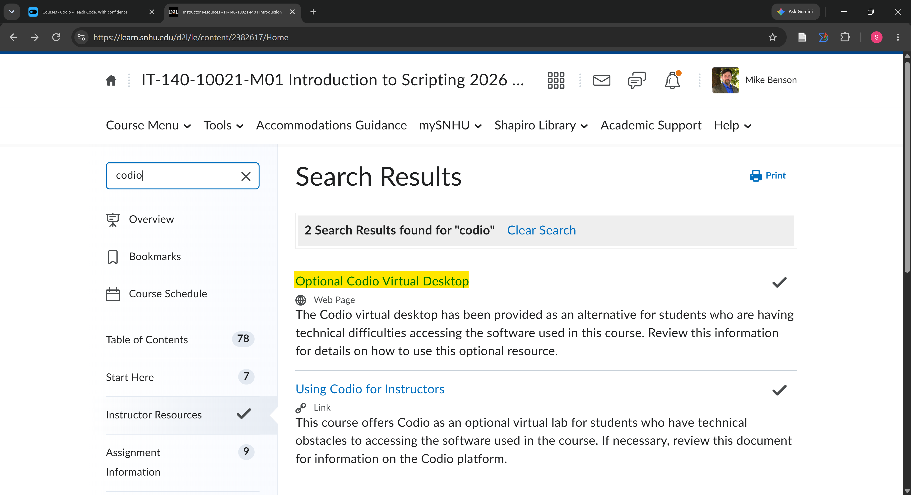
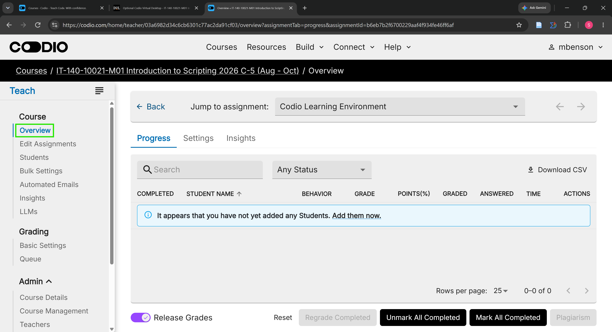

<!-- To see this file in a clean, formatted view, right-click on the filename and choose "Open Preview." -->

# IT 140 Faculty Setup Instructions

---

## 🧪 Beta Testing

The Module One Setup Tasks have completed end-to-end (E2E) Alpha Testing and are now in Beta Testing with faculty and staff.

The **Codio Virtual Desktop (CVD)** is the course reference environment and the preferred starting platform for students. The CVD automation is expected to be reliable because each CVD begins from a standardized environment. Local Windows, macOS, and Linux computers vary in software, settings, permissions, security controls, and prior configurations, so Beta Testing may uncover conditions that were not encountered during Alpha Testing.

Local setup is optional for students. Students using unsupported operating systems or devices, such as Chromebooks or tablets, should normally use the CVD rather than trying to reproduce the course IDE on an unsupported platform.

For course-wide information about the Beta, course IDE, repository model, GitHub workflow, activity-repository releases, Brightspace workflow, and common faculty questions, see the [IT 140 Faculty Guide](https://github.com/GC-STEM/it140/blob/main/.faculty/README.md).

If you choose to work through the Module One setup and encounter an issue or have a feature request, you are welcome to submit it using [GitHub Issues](https://github.com/GC-STEM/it140-m1-setup-tasks/issues).

---

## Table of Contents

- [IT 140 Faculty Setup Instructions](#it-140-faculty-setup-instructions)
  - [🧪 Beta Testing](#-beta-testing)
  - [Table of Contents](#table-of-contents)
  - [Activity Metadata](#activity-metadata)
  - [Overview of the Course IDE](#overview-of-the-course-ide)
  - [Course Platforms and Student Workflow](#course-platforms-and-student-workflow)
  - [1. Set Up A GitHub Account](#1-set-up-a-github-account)
  - [2. Set Up the Course IDE on Codio](#2-set-up-the-course-ide-on-codio)
  - [3. Review the Optional Local Course IDE](#3-review-the-optional-local-course-ide)
    - [Students on Unsupported Systems](#students-on-unsupported-systems)
  - [Guiding Students Through Setup](#guiding-students-through-setup)
    - [Start With the Student README](#start-with-the-student-readme)
    - [Keep the CVD as the Reference](#keep-the-cvd-as-the-reference)
    - [Keep Coursework Moving](#keep-coursework-moving)
    - [Follow Automation Results](#follow-automation-results)
    - [Use the Correct Support Channel](#use-the-correct-support-channel)
  - [Questions, Concerns, and Issues](#questions-concerns-and-issues)

## Activity Metadata

- **Course**: IT 140 - *Introduction to Scripting*
- **Activity Title**: 1-1 Setup Tasks | Faculty & Staff Setup
- **Activity Type**: Recommended
- **Activity Purpose**: Prepare faculty and staff to understand and use the IT 140 course IDE and GitHub repositories and to guide students through the Module One setup process.
- **Activity Description**: This activity provides faculty and staff with instructions for setting up a GitHub account, accessing and configuring the Codio Virtual Desktop (CVD), reviewing optional local setup, and understanding how the course development environment relates to D2L Brightspace.
- **Artifact Version**: 0.10.1-beta.1
- **Artifact Date**: 2026-08-11
- **Development Status**: Beta Testing

## Overview of the Course IDE

This README supplements the course-wide [IT 140 Faculty Guide](https://github.com/GC-STEM/it140/blob/main/.faculty/README.md).

The **IT 140 Faculty Guide** is the primary reference for:

- The purpose and components of the course IDE
- Why the CVD is the reference environment
- How course automation handles software installation and configuration
- The IT 140 GitHub repository model and student GitHub workflow
- How GitHub, Codio, the local course IDE, and D2L Brightspace fit together
- Activity-repository release status and scheduling
- Common faculty questions
- Course-wide questions, concerns, technical issues, and feature requests

This README is the primary reference for **faculty-specific Module One setup and access instructions**.

Faculty are encouraged to work through the student setup sequence so they understand what students will see and have a known reference environment when helping them.

The course automation manages the supported installation and configuration of Visual Studio Code (VS Code), Python, Git, GitHub CLI, course extensions, and related settings. Separate manual installation or installer-option instructions are therefore not part of the standard supported setup workflow.

For more information, see [Course IDE](https://github.com/GC-STEM/it140/blob/main/.faculty/README.md#course-ide) and [Common Faculty Questions](https://github.com/GC-STEM/it140/blob/main/.faculty/README.md#common-faculty-questions) in the IT 140 Faculty Guide.

## Course Platforms and Student Workflow

Faculty should understand the different roles of the systems students use.

| Platform                        | Role in IT 140                                                                                             |
| ------------------------------- | ---------------------------------------------------------------------------------------------------------- |
| **D2L Brightspace**             | Course content, assignment instructions, submissions, grading, instructor feedback, and student management |
| **Codio Virtual Desktop (CVD)** | Reference and preferred student development environment                                                    |
| **Local course IDE**            | Optional alternative development environment on a supported computer                                       |
| **GitHub**                      | Course repositories and Git/GitHub development workflow                                                    |
| **Visual Studio Code**          | Primary application for creating, editing, running, testing, and debugging course files                    |

The intended Module One student setup sequence is:

> **0 Start Here → 1 GitHub → 2 Codio → 3 Optional Local Computer → Done**

The CVD comes before local setup intentionally. It gives students access to a known course environment before they spend additional time configuring a personal computer.

Students should be encouraged to configure and verify the CVD even if they intend to work primarily on their own computer. Local installation is optional and is not necessary to complete IT 140.

> **Important**
>
> GitHub and Codio support the programming and development workflow. **Assignment submissions, grading, and instructor feedback remain in D2L Brightspace.**
>
> Do not use the Codio instructor dashboard or GitHub as a substitute for the normal Brightspace submission, grading, or feedback workflow unless a course activity explicitly directs otherwise.

## 1. Set Up A GitHub Account

As IT 140 faculty, you will need a GitHub account linked to your SNHU email address. You can add your SNHU email address to an existing GitHub account or create a new one specifically for this purpose.

1. Follow the [Set Up a GitHub Account](../github/README.md) instructions.
2. Return to this page after completing the GitHub setup. Faculty first access the Codio Virtual Desktop (CVD) differently than students.

Working through the student-facing GitHub instructions also helps you understand the account information students will need later when the course IDE is configured.

For an explanation of how GitHub is used later in IT 140, see [GitHub in IT 140](https://github.com/GC-STEM/it140/blob/main/.faculty/README.md#github-in-it-140) in the IT 140 Faculty Guide.

## 2. Set Up the Course IDE on Codio

The CVD is the **reference and preferred student development environment**. Faculty should become familiar with it even if they personally prefer to review course files on a local computer.

The CVD is important because:

- Course instructions, screenshots, and instructional videos use it as their reference.
- Each CVD begins from a more standardized environment than a typical personal computer.
- Faculty and technical support can more easily reproduce problems in it.
- It provides students with a supported environment without requiring installation of the full course IDE on their own computer.
- It provides a fallback when a student's local environment stops working.
- It is the recommended environment for students using unsupported operating systems or devices.

Although the Brightspace page is named **Optional Codio Virtual Desktop**, students should still be encouraged to configure and verify the CVD at least once. "Optional" means students do not have to perform all programming work in Codio; the CVD remains the course reference environment.

Faculty access the CVD differently than students:

1. From your IT 140 course site in [D2L Brightspace](https://learn.snhu.edu), select **Learning Modules** from the **Course Menu**.

   

2. Type **codio** in the search bar to see all pages that include the string.

   

   For future reference:

   - *Optional Codio Virtual Desktop* is under **Start Here**
   - *Using Codio for Instructors* is under **Instructor Resources**

3. Click the **Optional Codio Virtual Desktop** on the *Search Results* page.

4. Click the **Codio Learning Environment** link on the *Optional Codio Virtual Desktop* page to open the Codio instructor dashboard.

   

5. On the left menu bar of the *Codio instructor dashboard*, click **Overview**.

   

   *Note*. The Codio instructor dashboard is used in IT 140 only to access the Codio Virtual Desktop (CVD). **Assignment submissions, grading, instructor feedback, and student management remain in D2L Brightspace.**

6. Click the **Preview** button (looks like an eye) on the *Overview* page to open the Codio Virtual Desktop (CVD) landing page in a new browser tab.

   

7. This is the student landing page when they click on the **Optional Codio Virtual Desktop** link in D2L Brightspace. Consider bookmarking this CVD landing page for direct access in the future. <!-- If you are teaching more than one section of IT 140, you may want to bookmark both CVD URLs. -->

   

   *Note*. In IT 140, course IDE work is done within the **VM** tab that contains the Codio Virtual Desktop and the **Guide** tab. Neither students nor faculty need to use the other items on the main Codio menu bar for normal IT 140 coursework.

8. Read the *IT 140 Codio Virtual Desktop Guide* all the way through at least once so you are familiar with what your students will see and do in the CVD.

9. In the *IT 140 Codio Virtual Desktop Guide*, follow the student-facing Codio [**First-Time Setup**](../codio/README.md) instructions.

   *Note*. In Section 1, review how students access their CVD. Begin following the setup instructions at the point identified for faculty in the student CVD guide, where the course IDE is configured inside the CVD.

Complete the process through the final CVD **Verification Summary** so that you have a verified reference environment available when assisting students.

## 3. Review the Optional Local Course IDE

Local installation is **optional for students**. Students can complete IT 140 using the CVD without installing the course IDE on their own computer.

Faculty do not need a local installation to teach the course, but setting up the course IDE on a supported local computer can be useful for:

- Understanding the experience of students who choose local setup
- Beta Testing local automation on real-world computers
- Reviewing assignments and projects outside the CVD
- Comparing local behavior with the CVD reference environment

Start with the student-facing [Local Computer Setup](../local/README.md) page. It explains the supported options and the generic manual setup alternative.

The currently supported automated setup guides are:

- [Windows](../local/windows/README.md)
- [macOS](../local/macOS/README.md)
- [Linux](../local/linux/README.md)

If desired, you can install the course IDE on a local virtual machine (VM) instead of your host machine directly.

### Students on Unsupported Systems

If a student is using an unsupported operating system or device—for example, a Chromebook, tablet, unsupported Windows or macOS version, or another unsupported platform—the **recommended path is the CVD**.

The generic [Local Computer Setup](../local/README.md) includes a manual setup procedure for advanced users who intentionally want to configure an unsupported environment. This is a best-effort option, not the recommended student path.

Faculty should not expect students to make major system changes, disable security controls, bypass administrator restrictions, or replace their device merely to complete the optional local installation.

If local setup becomes a barrier to coursework, direct the student back to the CVD first.

## Guiding Students Through Setup

When helping students with Module One setup, use the following principles.

### Start With the Student README

The README files contain the current step-by-step procedures. The Setup Tasks wiki provides explanatory information, comparisons, and troubleshooting but does not replace the current README.

The normal student path is:

1. [Start Here](../README.md)
2. [Set Up a GitHub Account](../github/README.md)
3. [Set Up the Course IDE on Codio](../codio/README.md)
4. Optionally, [Set Up the Course IDE on a Local Computer](../local/README.md)

### Keep the CVD as the Reference

When a student asks which environment to use, the CVD is the preferred starting recommendation.

When comparing expected behavior, screenshots, software versions, or setup results, use the CVD as the reference environment.

A student who prefers a supported local installation may use it, but a local environment does not replace the value of having a configured CVD available.

### Keep Coursework Moving

If a local setup problem is taking significant time or preventing the student from completing coursework, have the student use the CVD while the local issue is investigated.

A local installation problem should not prevent a student from continuing IT 140.

### Follow Automation Results

If a setup script reports `FAIL`, `PARTIAL`, `NOT COMPLIANT`, a nonzero exit code, or another unexpected result:

1. Have the student read the final script summary.
2. Do not tell the student to guess at a repair or automatically continue to the next setup stage.
3. Follow any remediation instructions shown by the script or README.
4. Use [Setup Problems and Support](https://github.com/GC-STEM/it140-m1-setup-tasks/wiki/Setup-Problems-and-Support) if the problem remains unresolved.

Do not advise students to disable security software, bypass administrator controls, delete unrelated developer tools, or make major system changes unless the official course instructions explicitly call for that action.

### Use the Correct Support Channel

For a Module One setup or platform-specific problem, use the Setup Tasks documentation and support guidance.

For a course-wide automation, repository-status, or shared technical problem, use the main IT 140 repository.

For SNHU account access, Brightspace, Codio access, or another university-system problem, use the appropriate SNHU support channel.

For an individual student's assignment submission, grade, or instructor feedback, use the appropriate **private Brightspace or university communication channel**, not a public GitHub Issue or Discussion.

## Questions, Concerns, and Issues

The course-wide [IT 140 Faculty Guide](https://github.com/GC-STEM/it140/blob/main/.faculty/README.md#questions-concerns-or-issues) is the primary reference for faculty questions, concerns, and support channels.

For the initial pilot term, please post questions or concerns about the new course IDE or GitHub repositories in the [IT 140 Community of Practice](https://teams.microsoft.com/l/team/19:165fa3c3a9904a1999ca640d2ed13d27%40thread.tacv2/conversations?groupId=61d85fe7-44f7-4918-896f-bb83a07883c1&tenantId=2baef15b-b8de-423f-9d8a-46f3686d8848).

Please do **NOT** post faculty-sensitive questions, student-specific information, grades, or feedback in [GitHub Discussions](https://github.com/GC-STEM/it140/discussions), because it is also a student-facing forum.

For a technical issue or feature request specific to the Module One Setup Tasks, you are welcome to submit an issue in the [`it140-m1-setup-tasks` repository](https://github.com/GC-STEM/it140-m1-setup-tasks/issues).

When reporting an issue, include the relevant platform, step, expected result, actual result, and any error message or screenshot that may help reproduce the problem. Do not include passwords, authentication codes, access tokens, student information, grades, complete assignment solutions, or other private information.
