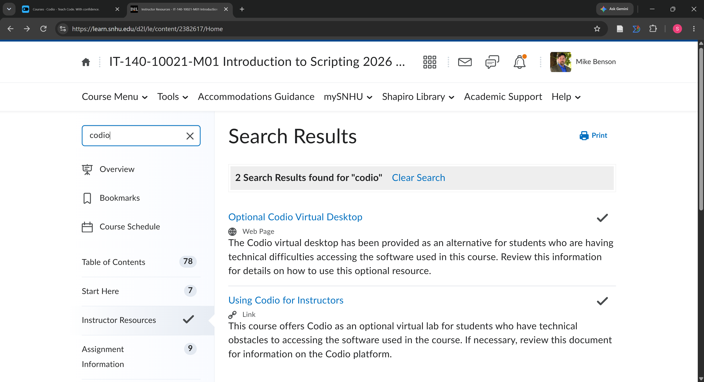
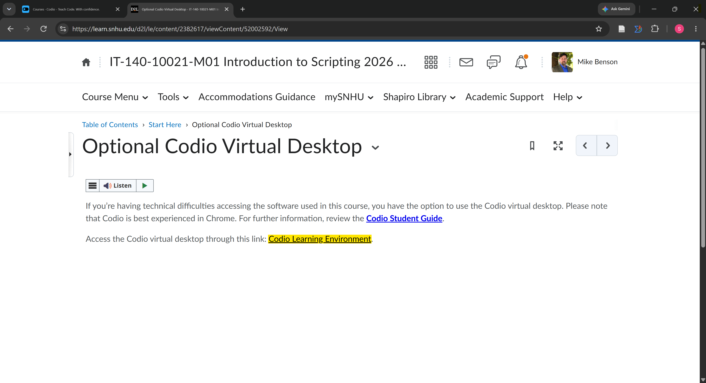
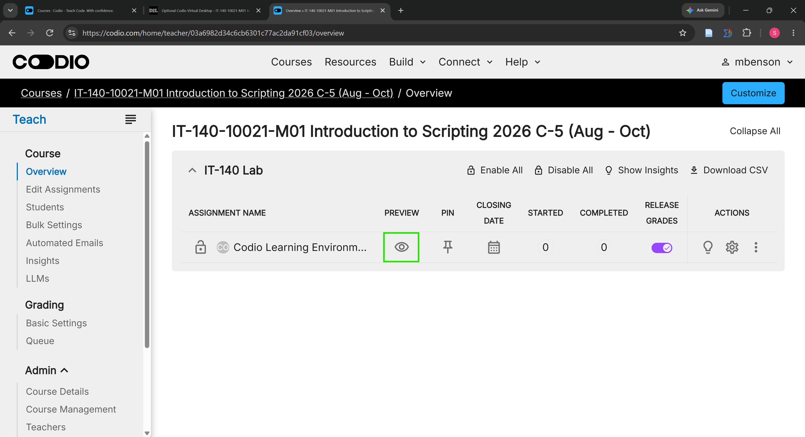

<!-- To see this file in a clean, formatted view, right-click on the filename and choose "Open Preview." -->

# IT 140 Faculty Instructions

---

## ⚠️ Under Construction

This repository is under active development. Code, documentation, structure, and features may change before the course begins. Check after August 9, 2026.

---

## 1. Set Up A GitHub Account

As IT 140 faculty, you will need a GitHub account linked to your SNHU email address. You can add your SNHU email address to an existing GitHub account or create a new one specifically for this purpose.

1. Follow the student-facing instructions in the [github/README.md](../github/README.md) with the following exception:
   - If creating a new GitHub account just for your SNHU role, use your SNHU email address but not your SNHU password.

2. Return to this page when done setting up your GitHub account. Faculty first access the Codio Virtual Desktop (CVD) differently than students.

## 2. Set Up the Course IDE on Codio

1. From your IT 140 course site in [D2L Brightspace](https://learn.snhu.edu), select **Learning Modules** from the **Course Menu**.

2. Type **Codio** in the search bar to see all pages that include that string.

    

    For future reference,
    - *Optional Codio Virtual Desktop* is under **Start Here**
    - *Using Codio for Instructors* is under **Instructor Resources**

3. Click the **Optional Codio Virtual Desktop** link to open the page.

    

4. Click the **Codio Learning Environment** link to open the Codio instructor dashboard.

    

    *Note*. You will not be able to use Codio instructor dashboard for any purpose other than to access your Codio Virtual Desktop (CVD). Assignment submissions, grading, and student management tasks will be done in D2L Brightspace.

5. On the left menu bar, click **Overview**.

    

6. Click the **Preview** button (looks like an eye) to open the Codio Virtual Desktop (CVD) in a new browser tab.

    

7. Consider bookmarking the CVD page for quicker future access. <!-- If you are teaching more than one section of IT 140, you may want to bookmark both CVD URLs. -->

8. Read the *IT 140 Codio Virtual Desktop Guide* all the way through at least once so you are familiar with what your students will see and do in the CVD.

9. In the *IT 140 Codio Virtual Desktop Guide*, follow the student-facing Codio [**First-Time Setup**](../codio/README.md) instructions.

    *Note*. When you get to **Section 1** just review it so you understand how students access their CVD. Start following instructions in **Section 2** to set up the course IDE in your CVD instance. This will give you the same experience as your students and allow you to help them if they have questions. You will also be able to see the course IDE in action and verify that it is working correctly.

## 3. Set Up the Course IDE Locally

It is also recommended to set up the official course IDE on your local machine. Again, this will allow you to view course assignments and projects outside of the Codio Virtual Desktop (CVD).

If desired, you can install the course IDE on a local virtual machine (VM) instead of your host machine. Course IDE setup has been tested on Windows Hyper-V and VirtualBuddy on macOS.

Follow the student-facing instructions in the appropriate local setup guide for your operating system:

- [Windows](local/windows/README.md)
- [macOS](local/macos/README.md)
- [Linux](local/linux/README.md)

## Questions, Concerns, or Issues

### Questions and Concerns

For the initial pilot term, please post any questions or concerns about the new course IDE or GitHub repositories in the [IT 140 Community of Practice](https://teams.microsoft.com/l/team/19:165fa3c3a9904a1999ca640d2ed13d27%40thread.tacv2/conversations?groupId=61d85fe7-44f7-4918-896f-bb83a07883c1&tenantId=2baef15b-b8de-423f-9d8a-46f3686d8848)

Please do **NOT** post faculty-related questions or concerns in [GitHub Discussions](https://github.com/GC-STEM/it140/discussions) as it is a student-facing forum.

### Technical Issues

If you encounter any technical issues with any content in the course GitHub repositories, please submit a GitHub issue in the appropriate repository. You can find the link to submit an issue in the [**Issues**](https://github.com/GC-STEM/it140/issues) tab of each repository.
