<!-- To see this file in a clean, formatted view, right-click on the filename and choose "Open Preview." -->

# IT 140 Module One: Setup Tasks | Codio Virtual Desktop (CVD)

- **Course**: IT 140 - *Introduction to Scripting*
- **Activity Title**: 1-1 Setup Tasks | Codio Virtual Desktop (CVD)
- **Activity Type**: Required, non-graded, no submission

## Table of Contents

- [IT 140 Module One: Setup Tasks | Codio Virtual Desktop (CVD)](#it-140-module-one-setup-tasks--codio-virtual-desktop-cvd)
  - [Table of Contents](#table-of-contents)
  - [What is a Codio Virtual Desktop (CVD)?](#what-is-a-codio-virtual-desktop-cvd)
  - [0. Prerequisites](#0-prerequisites)
  - [1. Launch the Codio Virtual Desktop (CVD)](#1-launch-the-codio-virtual-desktop-cvd)
  - [2. Clone the Main Course Repository to the CVD](#2-clone-the-main-course-repository-to-the-cvd)
  - [3. Update the CVD](#3-update-the-cvd)
  - [4. Configure the CVD](#4-configure-the-cvd)
  - [5. Sign into Cloud Storage Services (Optional)](#5-sign-into-cloud-storage-services-optional)
  - [6. Configure Visual Studio Code in the CVD](#6-configure-visual-studio-code-in-the-cvd)
  - [7. Verify the CVD](#7-verify-the-cvd)
  - [Next Steps](#next-steps)
  - [Troubleshooting](#troubleshooting)
    - [Update Script](#update-script)
      - [The Terminal Stops Showing New Output](#the-terminal-stops-showing-new-output)
        - [Symptoms the terminal is frozen or unresponsive](#symptoms-the-terminal-is-frozen-or-unresponsive)
        - [Corrective actions for a frozen or unresponsive terminal](#corrective-actions-for-a-frozen-or-unresponsive-terminal)

## What is a Codio Virtual Desktop (CVD)?

A Codio Virtual Desktop (CVD) is a cloud-based Linux desktop that you access through your web browser. It includes the IT 140 development environment (course IDE), so you can begin working on course assignments without installing software on your own computer.

The CVD is the course's reference development environment. Assignment instructions, screenshots, and instructional videos use the CVD, and instructors and technical support staff can most easily help you when you are using it.

Even if you plan to complete most of your work on your own computer, launch and configure the CVD at least once. If your local course IDE stops working or you need to use another computer, you can switch to the CVD and continue working with little interruption.

## 0. Prerequisites

To complete CVD configuration, you will need the following:

- [ ] Access to an IT 140 course in D2L Brightspace

- [ ] GitHub credentials (username, password, noreply email address)

- [ ] SNHU credentials (email, password), if using OneDrive for persistent storage

- [ ] Google credentials (email, password), if using Google Workspace for account sync and persistent storage

> [!TIP]
> You can find your GitHub username at [https://github.com/settings/profile](https://github.com/settings/profile)
>
> You can find your GitHub public noreply email address on [https://github.com/settings/emails](https://github.com/settings/emails) under the **Keep my email addresses private** section.
>
> It will look similar to `302326151+petey-penmen@users.noreply.github.com` but with your GitHub user ID and username.

## 1. Launch the Codio Virtual Desktop (CVD)

1. Go to [https://learn.snhu.edu/](https://learn.snhu.edu/) and log into Brightspace using your SNHU credentials.

   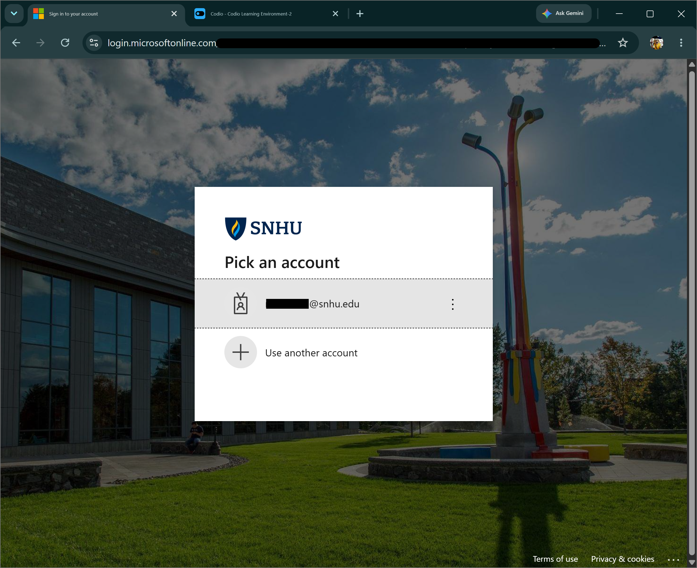

2. From your Brightspace homepage, under **My Courses**, find and click on your IT 140 course.

   *Note*. Your section number (IT-140-XXXXX) and term (YYYY, C-X (Mon - Mon)), may be different than shown in the following screenshots.

   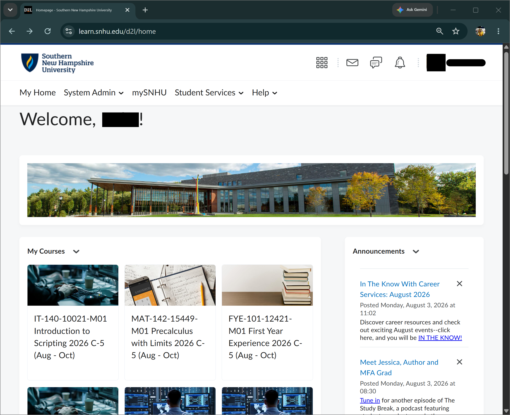

3. From the Course Menu, select **Learning Modules**

   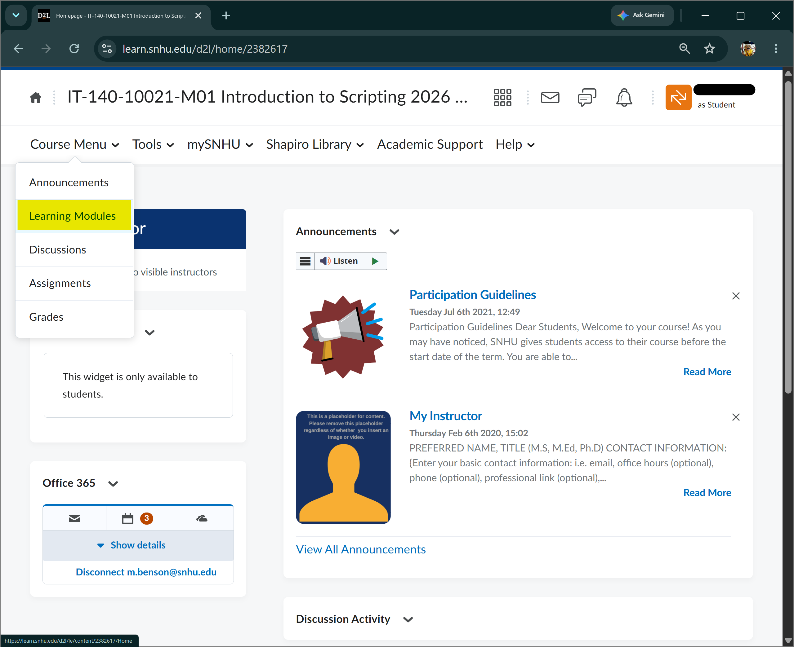

4. Click on the **Start Here** learning module.

   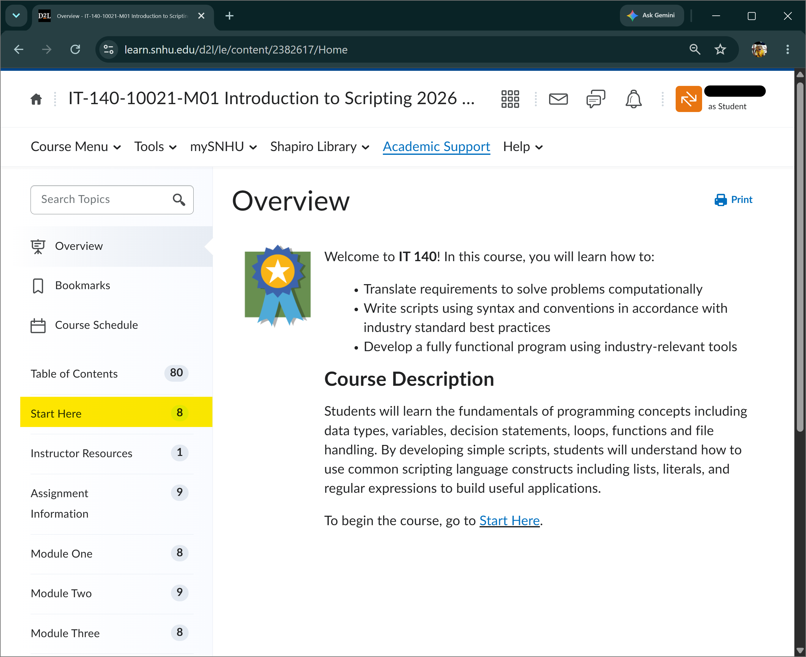

5. Scroll down and click on the **Optional Codio Virtual Desktop** web page link.

   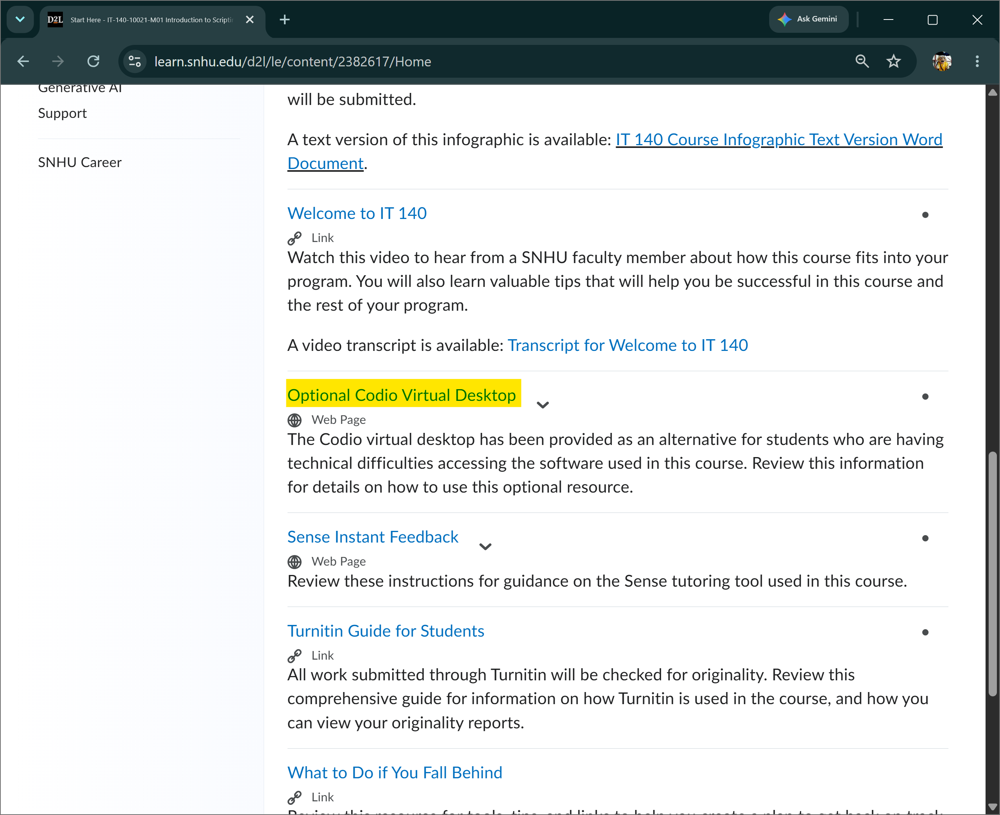

6. Click on the **Codio Learning Environment** link to launch Codio in a new browser tab.

   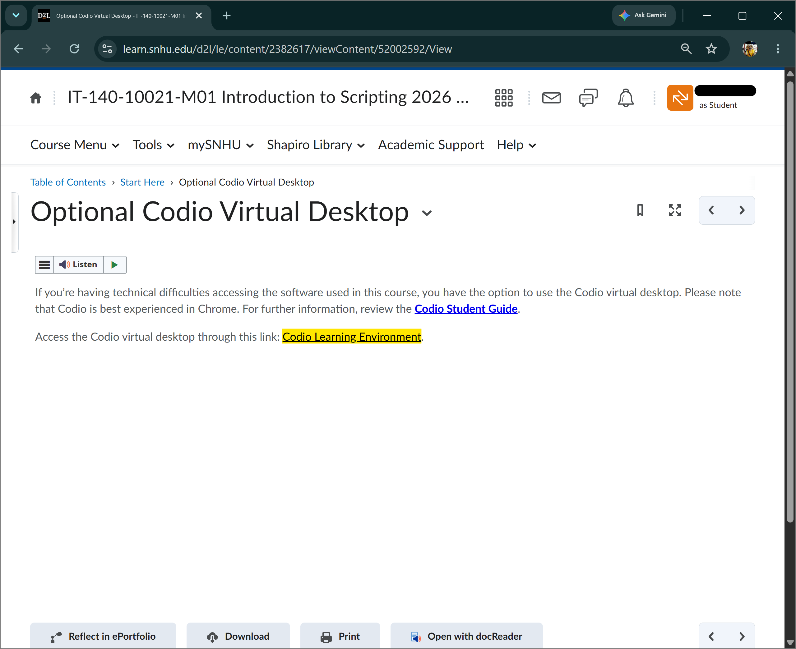

7. Read the *IT 140 Codio Virtual Desktop Guide* all the way through at least once.

   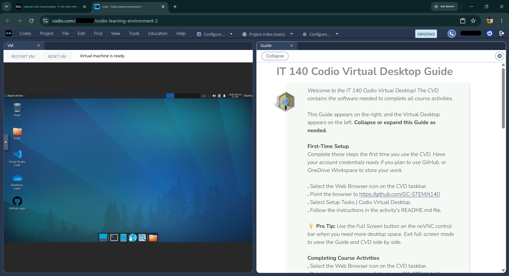

8. Click the **Collapse** button when done reading to hide the guide. You can always expand the guide again later if you need to reference it.

   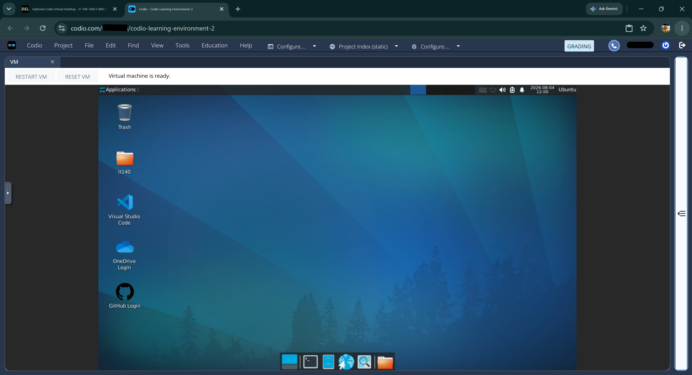

9. Expand the Codio Virtual Desktop (CVD) window to full screen for a better view of the CVD desktop.
   1. Click the Hide/Show button for the noVNC control bar on the middle left side of the CVD window.
   2. Click the middle **Full Screen** button the noVNC control bar to expand the CVD window to full screen.
   3. Click the **Full Screen** button again to exit full screen mode.
   4. Use the screen size which you prefer. You can always change it later.

   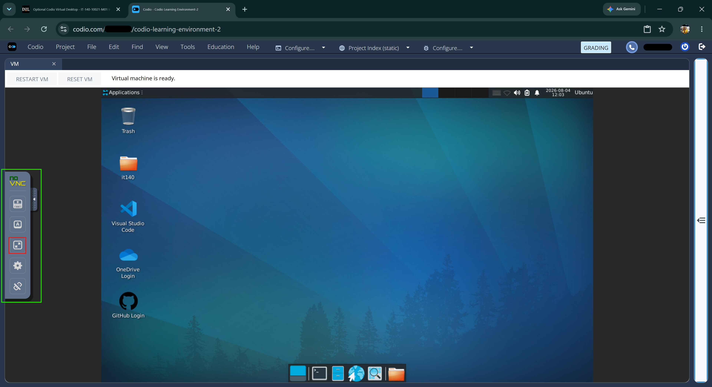

   *Important*. The **Full Screen** button is the only button on the noVNC control bar that you will likely need. Do **NOT** change any settings for the noVNC control bar. If you do, you may not be able to reconnect to it.

10. Bookmark the Codio Virtual Desktop (CVD) page in your local browser for direct access later.

## 2. Clone the Main Course Repository to the CVD

1. On the CVD desktop, click once on the **Terminal** icon in the taskbar to open a new terminal. It is the second icon from the left on the taskbar.

   

2. Using your pointing device (mouse, trackpad, etc.), click the **Copy** button in the top-right corner of the code block below. Only use the **Copy** button in code blocks like this to make sure you copy the code correctly.

   ```bash
   (
   set -Eeuo pipefail
   version="0.5.1"
   version_dtg="2026-08-01-11-06"
   course_root="$HOME/it140"
   log_dir="$course_root/logs"
   archive_url="https://github.com/GC-STEM/it140/archive/refs/heads/main.tar.gz"
   mkdir -p "$course_root" "$log_dir"
   chmod 700 "$log_dir"
   log_path="$log_dir/prepare_ide_$(date +%Y%m%d_%H%M%S).log"
   temp_root="$(mktemp -d "${TMPDIR:-/tmp}/it140-prepare.XXXXXX")"
   cleanup() { rm -rf -- "$temp_root"; }
   failed() { status=$?; printf 'ERROR: Preparation did not complete. Review: %s\n' "$log_path"; cleanup; exit "$status"; }
   trap failed ERR HUP INT TERM
   exec > >(tee -a "$log_path") 2>&1
   printf 'IT 140 Course IDE Prepare %s (%s)\n' "$version" "$version_dtg"
   printf 'User: %s\nPurpose: Acquire or refresh the course automation package.\nLog: %s\n' "$(id -un)" "$log_path"
   [[ "$(id -u)" -ne 0 ]]
   [[ "$(uname -s)" == "Linux" ]]
   command -v curl >/dev/null
   command -v tar >/dev/null
   archive_path="$temp_root/it140-main.tar.gz"
   stage_root="$temp_root/stage"
   mkdir -p "$stage_root"
   curl --fail --silent --show-error --location --retry 4 --retry-delay 2 --connect-timeout 20 --max-time 180 --output "$archive_path" "$archive_url"
   tar -xzf "$archive_path" -C "$stage_root"
   source_root="$(find "$stage_root" -mindepth 1 -maxdepth 1 -type d -name 'it140-*' -print -quit)"
   [[ -n "$source_root" ]]
   for script in prepare install configure verify update; do [[ -f "$source_root/scripts/cvd/${script}_ide.sh" ]]; done
   cp -a "$source_root/." "$course_root/"
   rm -rf -- "$course_root/.git"
   chmod +x "$course_root/scripts/cvd/"*.sh
   path_line='export PATH="$HOME/it140/scripts/cvd:$PATH"'
   touch "$HOME/.bashrc"
   grep -qxF "$path_line" "$HOME/.bashrc" || printf '\n%s\n' "$path_line" >> "$HOME/.bashrc"
   export PATH="$course_root/scripts/cvd:$PATH"
   hash -r
   trap - ERR HUP INT TERM
   cleanup
   printf "SUCCESS: The IT 140 automation package is ready.\nNext step: Close this terminal window by typing 'exit' and pressing 'Enter'.\nLog: %s\n" "$log_path"
   )
   ```

3. In the CVD terminal window, right-click at the end of the command prompt and select **Paste** from the popup menu.
   - Do NOT use keyboard shortcuts. If you use keyboard shortcuts (e.g., **Ctrl** + **V**), you will introduce unwanted characters into the command and it will not work.

   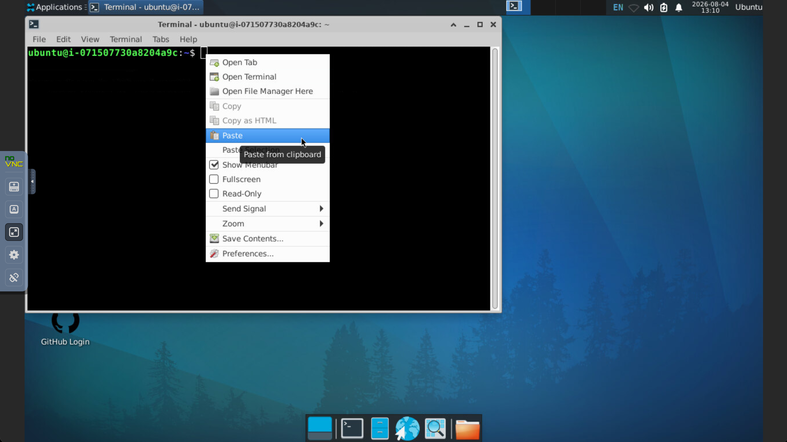

4. If you receive a pop-up message warning of potentially unsafe paste, click **Paste**.

   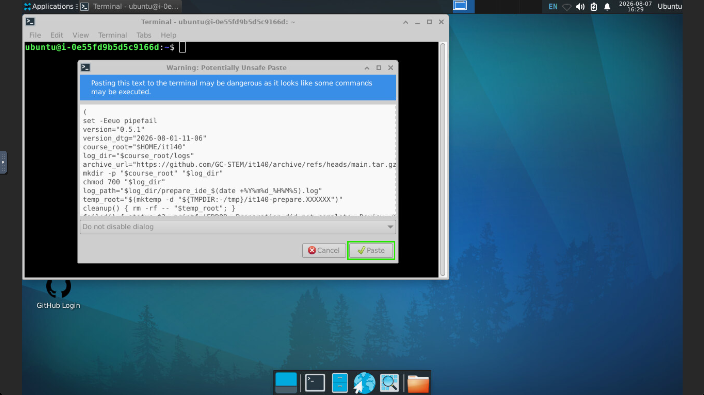

5. You should now see the pasted commands in the terminal window. With the terminal window selected, press **Enter** to run the pasted commands.

   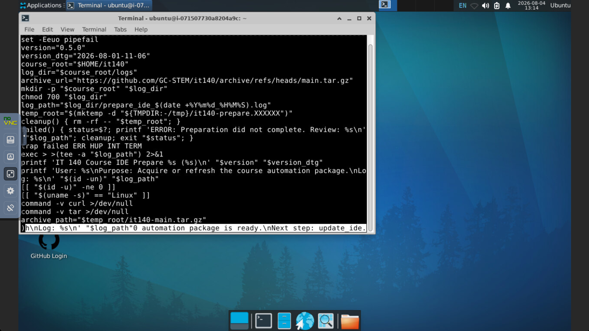

6. Review the output of the commands in the terminal window.
   - If you see a `SUCCESS` message, congratulations! Follow the `Next step` instructions in the message.
   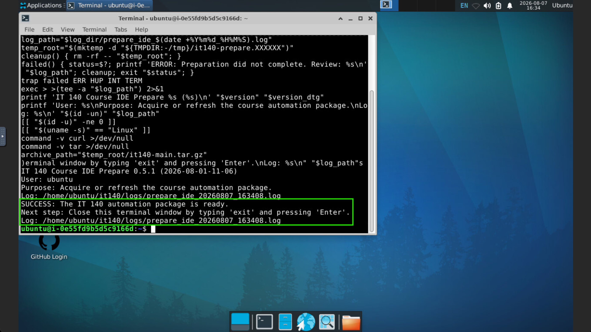
   - If the terminal window closes unexpectedly, reopen it and repeat Steps 2-6 again making sure you copy and paste the entire command set.
   - If you see an `ERROR` message, repeat Steps 2-6 making sure you copy and paste the entire command set.
   - If you still see an `ERROR` message, follow the instructions in the message and the [Troubleshooting](#troubleshooting) section below to resolve the issue.  
   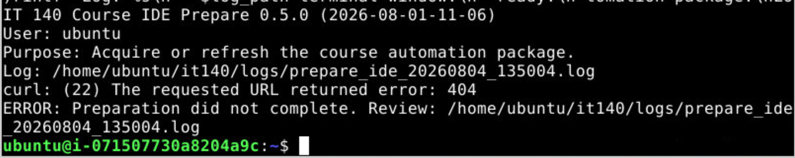
   - *Note*. A log file was created in your `it140/logs/` folder. If you encounter problems with the CVD, you may be asked to provide the log file to instructor or technical support for troubleshooting.

7. Close the terminal window by typing `exit` and pressing **Enter**. You must close the terminal window and open a new one before running the update script in the next step.

## 3. Update the CVD

> [!IMPORTANT]
> If you update the CVD after starting work on course activities, save your work on another platform, such as GitHub, OneDrive, or your local computer, before running the update script. This protects your work in case the update fails and the VM must be reset. You do not need to create a backup if you have not saved any work in the CVD yet.

1. Click once on the **Terminal** icon in the CVD taskbar to open a new terminal window.

2. Type `update_ide.sh` in the terminal window and press **Enter** to run the automated update script. Be patient. The update may take several minutes to complete.

   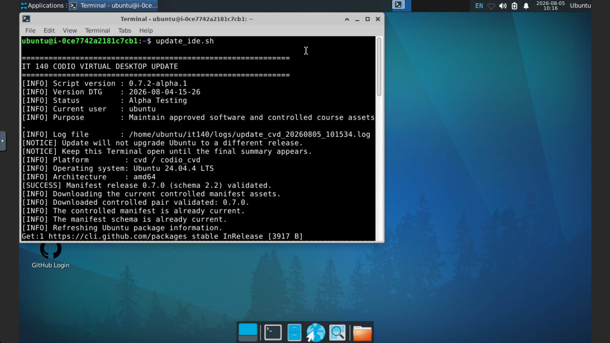

3. Review the **Update Summary**:
   - Confirm that **Result** is `PASS`.
   - Confirm that **Failures** is `0`.
   - Check the notices to determine whether a VM restart is required.

   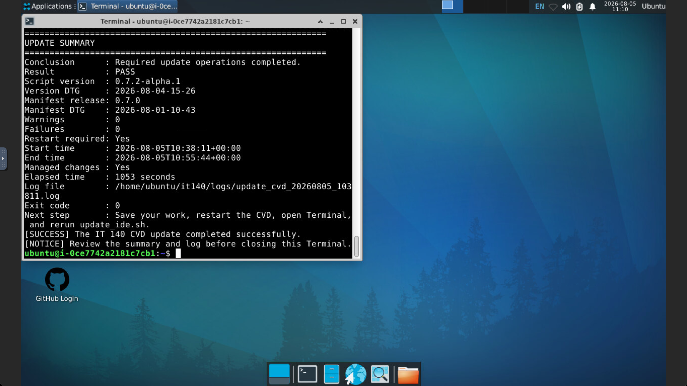

   {{SME TODO: Add what to do if Result is not PASS or Failures is not 0.}}

4. Close the terminal window by typing `exit` and pressing **Enter**.

5. If a VM restart is required:

   1. Save any open work and close all windows in the CVD.

   2. If you are in full screen mode, exit full screen mode by clicking the **Full Screen** button in the noVNC control bar.
   3. In the upper-left corner of the VM tab, click **RESTART VM** on the VM tab menu bar.  

   4. If prompted, click **YES** to confirm that you want to restart the VM.

   5. Wait for the CVD to restart and reconnect. This may take a few minutes.

   > 💡 *TIP*. If you are not sure if a restart is required, restart. It does not hurt and only takes a few minutes.

## 4. Configure the CVD

1. Click once on the **Terminal** icon in the CVD taskbar to open a new terminal window.

2. Type `configure_ide.sh` in the terminal window and press **Enter** to configure the CVD with an interactive script. *Interactive* means you will be prompted to provide input to the script during the configuration process.

   

3. Review the output of the configuration script to ensure that all checks passed successfully. Address any issues reported by the configuration script. The script may provide instructions for resolving specific issues. Re-running the setup and configuration scripts may resolve other issues. If you encounter problems that you cannot resolve, see the [**Troubleshooting**](#troubleshooting) section for assistance.

4. Close the terminal window by typing `exit` and pressing **Enter**.

## 5. Sign into Cloud Storage Services (Optional)

1. Double-click on the "OneDrive" icon on the CVD desktop to open the OneDrive login page in Chrome. Be patient, as it may take a few seconds for the browser to open.

2. Sign into Chrome using your Google Account credentials if you wish to synchronize your Google Account settings, bookmarks, and extensions with the CVD, or use G-Drive as persistent storage. Otherwise, you may skip this step.

3. Sign into OneDrive using your SNHU credentials if you wish to use OneDrive as persistent storage for your work in the CVD. Otherwise, you may skip this step. If you choose to sign into OneDrive, follow the steps below:

   1. Enter your SNHU email address and click **Next**.

      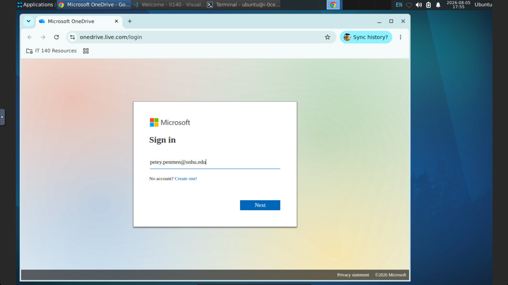

   2. Enter your SNHU password and click **Sign in**.

      

   3. Once signed in, you should see a web page that looks similar to the following.

      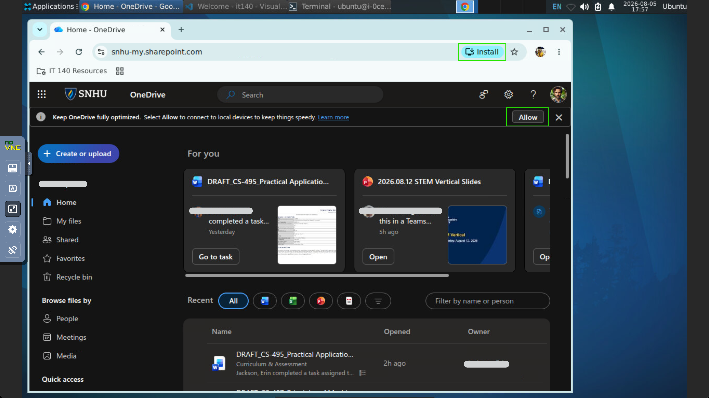

   4. If you see an **Install** button on the browser address bar near the upper-right, click it to install the OneDrive desktop app. If prompted to **Install app**, click **Install**. If you do not see an **Install** button, skip this step.

      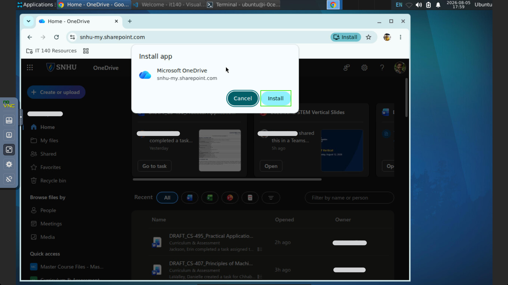

   5. If you see a prompt to **Keep OneDrive fully optimized**, click **Allow** to allow OneDrive to access local devices. If prompted to allow SharePoint to access other apps on and services on this device, click **Allow**. If you do not see this prompt, skip this step.

      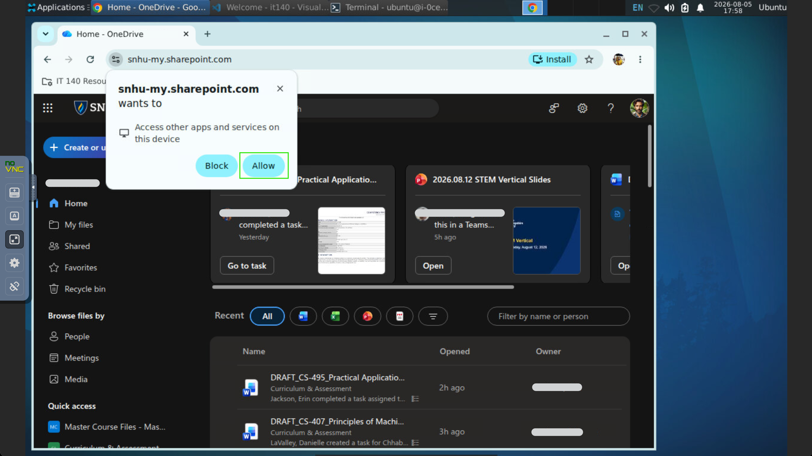

4. Close the browser and/or OneDrive window in the CVD when done signing into OneDrive and/or Chrome.

> [!NOTE]
> The first time you double-click on the OneDrive icon, you may see an **Untrusted application launcher** warning. If you see this message, click **Make Executable**.

## 6. Configure Visual Studio Code in the CVD

1. Double-click on the **Visual Studio Code** icon on the CVD desktop.

2. Sign into VS Code using one of the following methods:
   - **Continue with GitHub** (highly recommended)
   - **Sign in with Google** (click on **G** icon)
   - **Sign in with Apple** (click on Apple icon)
   - **Continue without Signing in**

   > [!NOTE]
   > If you do not see the Welcome page, click the blue **Sign in** button on the VS Code menu bar. If there is no **Sign in** button, you are likely already signed in.

3. If prompted to "Authorize Visual Studio Code", click **Continue**.

4. If prompted, **Open xdg-open?**, check the "Always allow" box and click **Open xdg-open** button.

5. If prompted, select your color theme. Course screenshots and videos show the "Dark High Contrast" theme, but you may choose the theme you prefer. Just keep in mind that screenshots and videos may look different than your VS Code environment if you choose a different theme.

6. Click the **Get Started** button.

7. In the popup message, click the **Trust** button or press **Ctrl** + **Enter**.
8. Close the **Workspace Trust** popup message by clicking the **X** in the upper-right corner of the message.

9. Optional: If you plan on working in both the CVD and a local course IDE, enable "Backup and Sync Settings..." in VS Code.
   1. Click on the gear icon in the lower-left corner of VS Code and select **Backup and Sync Settings...**.
   2. De-select any settings you do not want to synchronize between the CVD and your local course IDE. We recommend synchronizing all settings, but you may choose to exclude some if you prefer different settings in the CVD and your local course IDE.
   3. Click the **Sign in** button and select **Sign in with GitHub**.
   4. Follow the prompts to sign into your GitHub account and authorize VS Code to access your GitHub account.

10. Optional: If this is your first time using VS Code, we recommend you complete the VS Code **Walkthroughs** to familiarize yourself with the IDE. You will use VS Code for all course assignments and projects, so it is worth your time to learn how to use it effectively.

   > 💡 *TIP*.  If you ever see an **Update** button on the VS Code menu bar in the CVD, don't press it. You can ignore it or update the CVD by re-running `update_ide.sh`. Be sure to save your work on another platform (e.g., GitHub, OneDrive, your local machine) before updating the CVD, just in case the update fails and we need to reset your VM.

11. When you are done configuring VS Code, press **Ctrl** + **Q** to close the VS Code window or click the **X** in the upper-right corner of the window.

## 7. Verify the CVD

1. Click once on the **Terminal** icon in the CVD taskbar to open a new terminal window.

2. Type `verify_ide.sh` in the terminal window and press **Enter** to verify the CVD with an automated script.

3. Review the output of the verification script to ensure that all checks passed successfully.

4. Address any issues reported by the verification script. The script may provide instructions for resolving specific issues. Re-running the setup and configuration scripts may resolve other issues. If you encounter problems that you cannot resolve, see the [**Troubleshooting**](#troubleshooting) section for assistance.

5. Close the terminal window by typing `exit` and pressing **Enter**.

## Next Steps

When you are done configuring the CVD, close the CVD browser tab. DO NOT use the **Shut Down** option within the Ubuntu desktop. Codio will keep trying to reconnect to the CVD, which will prevent you from accessing it again until you log out of Codio and log back in.

Once you have completed Codio Virtual Desktop (CVD) configuration, you may stop here until you are ready to start on the Module Two assignment. However, we recommend you set up the course IDE on at least one local computer, if possible. Doing so provides an alternative development environment in case the CVD is unavailable and provides access after the course. Your VS Code and your GitHub account will synchronize your work between the CVD and your local course IDE, so you can continue working on assignments from either environment.

- **Set Up the Course IDE on Your Local Computer(s)**
  - [Windows](../local/windows/README.md)
  - [MacOS](../local/macos/README.md)
  - [Linux](../local/linux/README.md)

## Troubleshooting



### Update Script

The update script normally takes about **4–5 minutes**, but it may take **15–30 minutes or longer**. Longer update times are more likely when:

- You run the script for the first time on a fresh CVD.
- Ubuntu has many pending updates.
- The script must download large system or Linux kernel packages.
- Your network connection is slow or temporarily unstable.
- An Ubuntu download server is busy or temporarily unavailable.
- Ubuntu automatically retries an interrupted or unsuccessful download.

#### The Terminal Stops Showing New Output

##### Symptoms the terminal is frozen or unresponsive

The Terminal may appear to stop at a line beginning with `Get:` or `Ign:`. No new text may appear for several minutes.

For example:

```text
Get:2 ... linux-modules ... [148 MB]
Ign:2 ... linux-modules ...
```

This usually means Ubuntu is downloading a large file, waiting for the download server, or automatically retrying the download. An `Ign:` line does not necessarily mean that the update failed.

##### Corrective actions for a frozen or unresponsive terminal

1. Keep the Terminal open.
2. Do not press keys or start another update command.
3. Wait up to **30 minutes after the last new line appears**.

Do not interrupt the script only because its total running time exceeds 30 minutes. Continue waiting as long as new lines occasionally appear.

If no new text appears for **30 consecutive minutes** **AND** the last line begins with `Get:` or `Ign:`:

1. Press `Ctrl+C` once.
2. Wait for the script to stop and display its summary.
3. Close the Terminal.
4. Open a new Terminal.
5. Run the update script again by typing `update_ide.sh` and pressing `Enter`.

> [!IMPORTANT]
> Do not interrupt the script while the Terminal displays messages such as:

```text
Unpacking
Setting up
Processing triggers
```

These messages mean Ubuntu is installing or configuring software rather than downloading it.

If the script repeatedly stops at the same download, take a screenshot of the Terminal and contact course support. Include the update log from the following folder:

```text
~/it140/logs/
```
