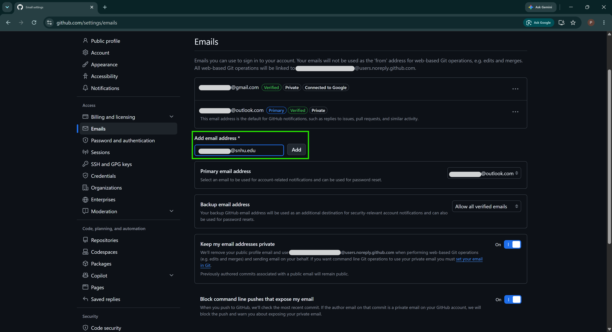
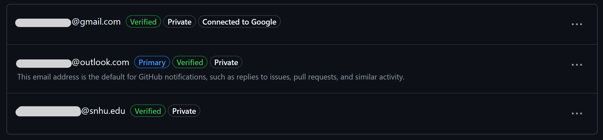
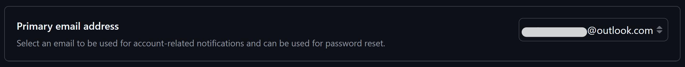
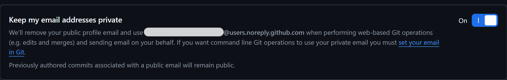
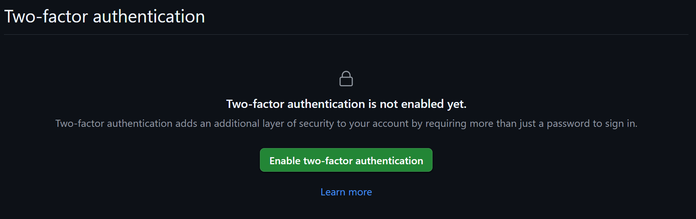

# Set Up a GitHub Account

**Setup progress:** [0 Start Here](../README.md) → **1 GitHub** → [2 Codio](../codio/README.md) → [3 Local Computer](../local/README.md) → **Done**

## Table of Contents

- [Set Up a GitHub Account](#set-up-a-github-account)
  - [Table of Contents](#table-of-contents)
  - [Activity Metadata](#activity-metadata)
  - [What You Will Do](#what-you-will-do)
  - [How IT 140 Uses GitHub](#how-it-140-uses-github)
  - [0. Sign Up for a New GitHub Account](#0-sign-up-for-a-new-github-account)
  - [1. Configure Your GitHub Email Addresses](#1-configure-your-github-email-addresses)
  - [2. Secure Your GitHub Account](#2-secure-your-github-account)
  - [GitHub Account Ready Check](#github-account-ready-check)
  - [3. Customize Your GitHub Profile](#3-customize-your-github-profile)
  - [Continue to Step 2: Set Up Codio](#continue-to-step-2-set-up-codio)
  - [Learn More or Get Help](#learn-more-or-get-help)

## Activity Metadata

- **Course**: IT 140 - *Introduction to Scripting*
- **Activity Title**: 1-1 Setup Tasks | GitHub Account Setup
- **Activity Type**: Recommended, non-graded, no submission
- **Activity Purpose**: Set up a GitHub account for use in the IT 140 course.
- **Activity Description**: This activity guides students through creating or configuring a GitHub account, verifying email addresses, enabling two-factor authentication, and identifying the account information used by the course IDE. Course instructions beginning in Module Two assume that students can access GitHub for assignment and project repositories.
- **Artifact Version**: 0.10.0-beta.1
- **Artifact Date**: 2026-08-09
- **Development Status**: Beta Testing

## What You Will Do

In this guide, you will:

1. Create a GitHub account or prepare an account you already use.
2. Add and verify the email addresses used for IT 140.
3. Protect your email address with GitHub's privacy settings.
4. Configure two-factor authentication (2FA).
5. Record your GitHub username and public noreply email address for the course IDE setup.
6. Review profile settings you may want to customize now or later.

You are ready to continue when the **GitHub Account Ready Check** near the end of this guide is complete.

## How IT 140 Uses GitHub

IT 140 uses GitHub to host programming repositories. Beginning with the Module Two Assignment, course instructions will direct you to use Visual Studio Code (VS Code) to *clone* (copy) the appropriate assignment or project repository into your `Repos` folder. You will then work with those files in the course IDE.

You do **not** need to clone the central **IT 140** course repository or this **Module One Setup Tasks** repository. These repositories provide course infrastructure and setup instructions. Only clone an assignment or project repository when the course instructions direct you to do so.

For a beginner-friendly explanation of Git, GitHub, repositories, professional uses, GitHub Education, and additional learning resources, see **[GitHub in IT 140](https://github.com/GC-STEM/it140-m1-setup-tasks/wiki/GitHub-in-IT-140)**.

## 0. Sign Up for a New GitHub Account

If you already have a GitHub account that you want to use for this course, skip to [Step 1](#1-configure-your-github-email-addresses). Otherwise, follow the instructions below to create a new GitHub account.

1. Go to [https://github.com/signup](https://github.com/signup).

2. Enter your email address and password:
   - **Students**: Continue with Google or Apple or manually enter another personal email address. Do **NOT** use your SNHU email or password here.
   - **Faculty and Staff**: Use your SNHU email address. Do **NOT** use your SNHU password here.

3. Enter a professional username that you are comfortable sharing publicly. For guidance on selecting a professional username, see [github_username.md](github_username.md).

4. Check or uncheck optional checkboxes, as desired. You do not need to check any of the optional boxes for this course.

5. Review GitHub’s *Terms of Service* and *Privacy Statement*, if desired. An AI chatbot can help you understand these documents.

6. Click the **Create account** button.

7. Check your email for a verification message from GitHub.

8. Follow the instructions in the verification email to complete the sign-up process.

## 1. Configure Your GitHub Email Addresses

1. Go to [https://github.com/settings/emails](https://github.com/settings/emails).

2. Sign in using the method you used when creating your GitHub account.

3. In the **Add email address** field, enter at least one other email address and click **Add**.
   - **Students**: Add your SNHU email address to your GitHub account.
   - **Faculty & Staff**: Add a personal address to your GitHub account.
   - *Optional*. Add other email addresses as backups, if desired.

   

4. Check your email inbox for a verification message from GitHub.
   - If you do not see a message for each email address added, check your Junk or Spam folder.
   - Click the **Verify email address** button in the message to confirm that you own the email address, or copy and paste the URL into your browser.
   - Repeat this step for each email address you added to your GitHub account.

5. Back in [GitHub > Settings > Emails](https://github.com/settings/emails), refresh the page to confirm that all email addresses are listed as verified.

   

6. **Optional**. Change your **Primary email address** from the list of verified addresses to the one you desire. This is the address that GitHub will use for notifications and other communications.

   

7. Scroll down and turn on **Keep my email addresses private**.

   

8. Remember your GitHub-provided public email address. You will need it to configure the course IDE. The public email address will look similar to `302346351+your-username@users.noreply.github.com`.

9. Turn on **Block command line pushes that expose my email**.

   

## 2. Secure Your GitHub Account

GitHub requires users who contribute code to configure [two-factor authentication](https://docs.github.com/authentication/securing-your-account-with-two-factor-authentication-2fa/about-two-factor-authentication) (2FA). Two-factor authentication requires an additional form of verification when you sign in and helps protect your account if someone obtains your password.

You may use the same 2FA method that you use for your SNHU account, such as [Microsoft Authenticator](https://www.microsoft.com/en-us/security/mobile-authenticator-app). Your GitHub and SNHU accounts remain separate; do not use your SNHU password for GitHub.

1. Go to [https://github.com/settings/security](https://github.com/settings/security).

2. Under **Two-factor authentication**, click the **Enable two-factor authentication** button.

   

3. Follow GitHub’s on-screen instructions to configure a two-factor authentication (2FA) method. This step is time-sensitive. One-time codes expire quickly.

   *TIP*. Use the same authenticator app you use for your SNHU account. This is usually the [Microsoft Authenticator](https://support.microsoft.com/en-us/authenticator/download-microsoft-authenticator) app from the [Apple](https://apps.apple.com/us/app/microsoft-authenticator/id983156458) or [Google Play](https://play.google.com/store/apps/details?id=com.azure.authenticator) stores.

   *WARNING*. Only enable SMS text messages authentication if you have no other option. SMS is less secure than other methods, such as an authenticator app or a security key.

4. Download or copy your recovery codes when prompted.

5. Store your recovery codes in a secure location separate from the device you normally use to sign in.

   *Important*. Recovery codes can help you regain access to your account if you lose access to your normal authentication method. Store them securely. Do not save your only copy on a device that could be lost or damaged.

6. **Recommended**. Add a passkey if your device and browser support one.

> [!WARNING]
> Do not share your password, passkey, authentication codes, or recovery codes with anyone. Neither GitHub nor SNHU will ever ask you for this information. If someone asks for it, report the request to GitHub and SNHU immediately.

## GitHub Account Ready Check

Before continuing to the course IDE setup, confirm that the account information used by IT 140 is ready:

- [ ] You can sign in to your GitHub account.
- [ ] The email addresses you added for this activity show as verified.
- [ ] **Keep my email addresses private** is turned on.
- [ ] You know your GitHub username.
- [ ] You have recorded your GitHub-provided `@users.noreply.github.com` email address.
- [ ] Two-factor authentication (2FA) is configured and your recovery codes are stored securely.

If all of these checks are complete, the GitHub account information needed to configure the course IDE is ready.

The profile-customization step below can help you begin building a professional GitHub presence, but it does not affect whether the course IDE can connect to your account.

## 3. Customize Your GitHub Profile

1. Go to [https://github.com/settings/profile](https://github.com/settings/profile).

2. Sign in to GitHub, if prompted.

3. **Optional**. Add or change profile information that you wish to share publicly. Remove any information you do not want to be public. For example, you can:
   - Add an avatar image;
   - Include a brief bio;
   - Add links to social media;
   - Add a [profile README](https://docs.github.com/en/account-and-profile/how-tos/profile-customization/managing-your-profile-readme) (advanced);
   - Click the **Update profile** button to save your changes.

   For an example user profile with custom README, see [Petey Penmen's profile](https://github.com/petey-penmen).

4. Scroll down to **Contributions & activity**.

   1. Consider leaving the **Make profile private and hide activity** checkbox unchecked. Checking this box only hides your activity and social information, such as your contribution graph, achievements, activity feed, organization memberships, and follower information. It does not make public repositories private or hide the profile information noted above.

   2. Consider checking the **Include private contributions on my profile** checkbox. This lets your GitHub contribution graph reflect work you do in private repositories (e.g., course assignments) without revealing the repositories or their contents.

   3. Click the **Update preferences** button to save your changes.

5. Scroll down to **Profile settings**.

   1. Check the **Show Achievements on my profile** checkbox, if desired. This lets your GitHub profile display badges for achievements you earn.

   2. Click the **Update preferences** button to save your changes.

6. If your preferred spoken language is not English, scroll down to **Trending settings** and update your **Preferred spoken language**, if desired, and **Save Trending settings**.

## Continue to Step 2: Set Up Codio

After the **GitHub Account Ready Check** is complete, continue directly to the Codio guide:

**[Continue to Step 2: Set Up the Course IDE on Codio →](../codio/README.md)**

The CVD is the course reference environment. Configuring it gives you an environment that matches course screenshots, instructional videos, and the environment instructors and technical support staff can most easily reproduce.

## Learn More or Get Help

- Learn more about Git and GitHub: **[GitHub in IT 140](https://github.com/GC-STEM/it140-m1-setup-tasks/wiki/GitHub-in-IT-140)**
- Get help with account or setup problems: **[Setup Problems and Support](https://github.com/GC-STEM/it140-m1-setup-tasks/wiki/Setup-Problems-and-Support)**
