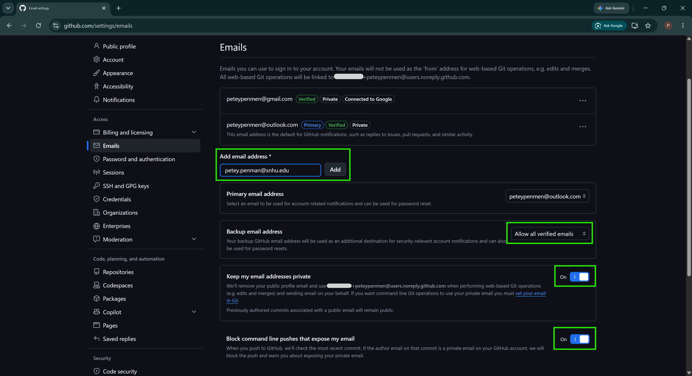

# Set Up a GitHub Account

## Table of Contents

- [Set Up a GitHub Account](#set-up-a-github-account)
  - [Table of Contents](#table-of-contents)
  - [What Are Git and GitHub?](#what-are-git-and-github)
  - [0. Sign Up for a New GitHub Account](#0-sign-up-for-a-new-github-account)
  - [1. Configure Your GitHub Email Addresses](#1-configure-your-github-email-addresses)
  - [2. Secure Your GitHub Account](#2-secure-your-github-account)
  - [3. Customize Your GitHub Profile (Optional)](#3-customize-your-github-profile-optional)
  - [4. Join GitHub Education (Optional)](#4-join-github-education-optional)
  - [Next Step](#next-step)
  - [Troubleshooting](#troubleshooting)

## What Are Git and GitHub?

**[Git](https://git-scm.com/)** is a version control system included in the course integrated development environment (IDE). Git allows developers to track changes to project files, restore earlier versions, and maintain a history of their work. It also supports multiple developers working on the same project without overwriting each other’s changes. Employers consider Git a foundational skill for entry-level software developers [[1](https://doi.org/10.1109/ESEM64174.2025.00055)].

**[GitHub](https://github.com/)**, which is owned by Microsoft, is a widely used web-based platform for storing and sharing Git repositories, reviewing changes, and collaborating on software projects. A repository, or "repo", is a folder that stores project files and their change history. In a recent survey, developers ranked GitHub as the most admired community platform and the most desired code documentation and collaboration tool [[2](https://survey.stackoverflow.co/2025/technology#2-community-platforms), [3](https://survey.stackoverflow.co/2025/technology#2-code-documentation-and-collaboration-tools)]. This course uses GitHub to host its code repositories.

National job-posting data identifies both Git and GitHub as in-demand technologies for software-development positions [[4](https://www.onetonline.org/link/demand/15-1252.00)]. IT 140 introduces these tools so students can learn to organize, track, and manage programming projects. These skills support both course work and future professional use.

## 0. Sign Up for a New GitHub Account

If you already have a GitHub account that you want to use for this course, skip to [Step 1](#1-configure-your-github-email-addresses). Otherwise, follow the instructions below to create a new GitHub account.

1. Go to [https://github.com/signup](https://github.com/signup).

2. Manually enter your email address and password.:
   - **Students**: Use a personal email address. Do **NOT** use your SNHU email or password here.
   - **Faculty and Staff**: Use your SNHU email address. Do **NOT** use your SNHU password here.

3. Enter a professional username. For guidance on selecting a professional username, see [github_username.md](github_username.md).

4. Check or uncheck optional checkboxes, as desired. You do not need to check any of the optional boxes for this course.

5. Review GitHub’s *Terms of Service* and *Privacy Statement*, if desired. An AI chatbot can help you understand these documents.

6. Click the **Create account** button.

7. Check your email for a verification message from GitHub.

8. Follow the instructions in the verification email to complete the sign-up process.

## 1. Configure Your GitHub Email Addresses

1. Go to [https://github.com/settings/emails](https://github.com/settings/emails).

2. Sign in using the method you used when creating your GitHub account.

3. In the **Add email address** field, enter another email address and click **Add**.
   - **Students**: Add your SNHU email address to your GitHub account.
   - **Faculty & Staff**: Add a personal address to your GitHub account.
   - *Optional*. Add other personal email address(es) as backups, if desired.

   

4. Check your added email Inbox(es) for a verification message from GitHub. If you do not see a message for each email address added, check your Junk or Spam folder.

5. Follow the instructions in the email to verify the address.

6. Confirm that your SNHU email address is listed as verified.

7. Scroll down and turn on **Keep my email addresses private**.

8. Note your GitHub-provided public email address. It will look similar to `302346351+petey-penmen@users.noreply.github.com`.

9. Turn on **Block command line pushes that expose my email**.

## 2. Secure Your GitHub Account

GitHub requires users who contribute code to configure [two-factor authentication](https://docs.github.com/authentication/securing-your-account-with-two-factor-authentication-2fa/about-two-factor-authentication) (2FA). Two-factor authentication requires an additional form of verification when you sign in and helps protect your account if someone obtains your password.

You may use the same 2FA method that you use for your SNHU account, such as [Microsoft Authenticator](https://www.microsoft.com/en-us/security/mobile-authenticator-app). Your GitHub and SNHU accounts remain separate; do not use your SNHU password for GitHub.

1. Go to [https://github.com/settings/security](https://github.com/settings/security).

2. Under **Two-factor authentication**, click **Enable two-factor authentication**.

3. Follow GitHub’s on-screen instructions to configure an authentication method.

4. Download or copy your recovery codes when prompted.

5. Store your recovery codes in a secure location separate from the device you normally use to sign in.

   *Important*. Recovery codes can help you regain access to your account if you lose access to your normal authentication method. Store them securely. Do not save your only copy on a device that could be lost or damaged.

6. Do not share your password, authentication codes, or recovery codes with anyone.

7. *Optional*. Add a passkey if your device and browser support one.

## 3. Customize Your GitHub Profile (Optional)

If desired, you can make your GitHub profile private or personalize it. You can always change your profile settings later. To configure your GitHub profile, follow the instructions below.

1. Go to [https://github.com/settings/profile](https://github.com/settings/profile).

2. Sign in, if not already.

3. Make your profile private, if desired (not recommended for teaching faculty).
   1. Scroll down to **Contributions & activity**.
   2. Check the **Make profile private and hide activity** option.
   3. Click the **Update preferences** button to save your changes.

4. Add or change other profile information as desired. For example, you can
   - Add an avatar image;
   - Include a bio;
   - Add links to social media profiles

5. Click the **Update profile** button when done to save your changes.

## 4. Join GitHub Education (Optional)

[GitHub Education](https://education.github.com/) provides eligible students and faculty with free access to GitHub benefits and professional development tools. These tools are not required for IT 140 but may be useful if you take additional programming or technical courses. You may skip this section and apply later.

Read how to Apply to GitHub Education:

- [for Students](https://docs.github.com/en/education/about-github-education/github-education-for-students/apply-to-github-education-as-a-student)
- [for Faculty & Staff](https://docs.github.com/en/education/about-github-education/github-education-for-teachers/apply-to-github-education-as-a-teacher).

1. Go to [https://github.com/settings/education/benefits](https://github.com/settings/education/benefits).
2. Sign in, if needed.
3. Click **Learn more** to review the available benefits.
4. Click **Start an application**.
5. Complete and submit the **Education Benefits Application**.
6. Check your email for follow-up messages from GitHub Education.
   - GitHub may request additional information to verify your educational status.

## Next Step

Once your GitHub account is set up, your SNHU email address is verified, and you have recorded your GitHub username and public noreply email address, you are ready to configure the course IDE on the Codio Virtual Desktop (CVD).

- [Set Up the Course IDE on Codio](../codio/README.md)

## Troubleshooting


