<!-- To see this file in a clean, formatted view, right-click on the filename and choose “Open Preview.” -->

# IT 140 Development Environment Local Setup on Windows

This document provides instructions for optionally setting up an IT 140 development environment (course IDE) on the Windows 11 operating system. It covers the installation of necessary software and tools needed to complete all course activities.

## 1. Create a Restore Point

Before installing any software, it is best practice to create a restore point using Windows System Protection recovery feature. That way, you can undo system changes if something goes wrong during setup.

1. On your keyboard, hold down the **Windows** (⊞) key and press the **S** key to open the **Search** application. In the search box, start typing ***Create a restore point***. Select the **Create a restore point** app from the results when it appears.  <br>
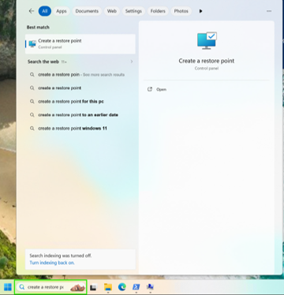
&nbsp;&nbsp;&nbsp;&nbsp;&nbsp;
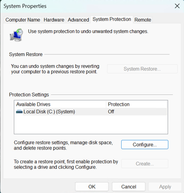

2. If the **Create…** button is selectable, skip to Step 4.<br>
   If the **Create…** button is not selectable, as shown in the above right image, click the **Configure…** button.

3. Select the **Turn on system protection** radio button and adjust the **Max Usage** slider to 5%.
Click the **OK** button.  <br>
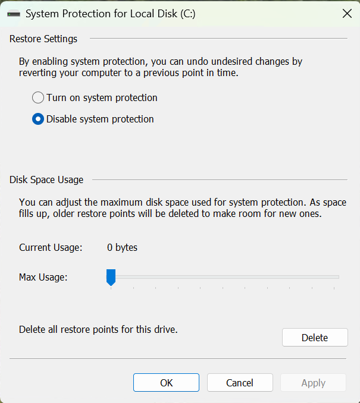
&nbsp;&nbsp;&nbsp;&nbsp;&nbsp;
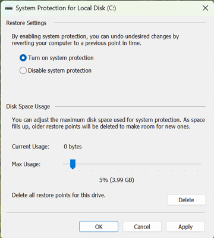

4. Click the **Create…** button. Enter a descriptive name for the restore point in the **System Protection** popup window, such as ***IT140 Course IDE Setup*** and click the **Create** button.  <br>
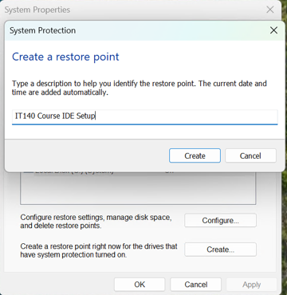
&nbsp;&nbsp;&nbsp;&nbsp;&nbsp;
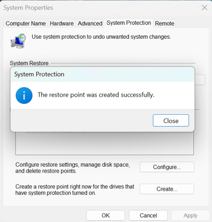

5. After the restore point is created, click the **Close…** button.

### Restore System (*if needed*)

For future reference: If you ever want to restore your system to the state before you created a restore point without affecting your personal files, repeat Step 1 and click the System Restore button and then the **Next>** button. Select the desired restore point from the list and click the second **Next>** button. Then, click the **Finish** button.  <br>
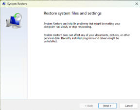
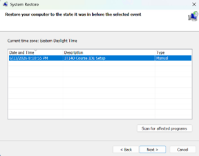
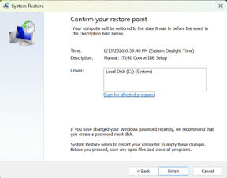

## 2. Open a Terminal Window

The next phase in setting up the course IDE on your local Windows machine is to open a PowerShell terminal window with administrator privileges. You can do this by following these steps:

1. Hold down the **Windows** (⊞) key on your keyboard and press the **R** key to open the **Run** application.

2. In the **Run** dialog box, type ***powershell*** and press **Ctrl** + **Shift** + **Enter** to open with administrator privileges, regardless of which version of Run you see.  <br>
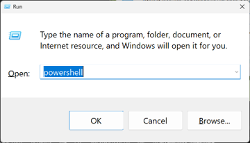
&nbsp;&nbsp;&nbsp;&nbsp;&nbsp;
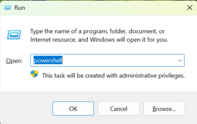

3. Verify the PowerShell terminal window title bar shows **Administrator: Windows PowerShell**, as shown in the image below. If it does not, close the window and repeat Steps 1–2.  <br>
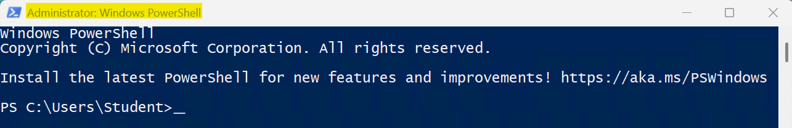

>*Note*. The colors of your terminal window and prompt path (C:\Users\USERNAME) may be different than those shown in the screenshots, which is fine. Just make sure the window title bar shows **Administrator: Windows PowerShell**

**⚠️ IMPORTANT**. Do NOT proceed with the next phase of the installation until you successfully complete this step. Refer to the Troubleshooting section of this guide for additional help. If you get stuck, you can always use the course IDE in the Codio Virtual Desktop (CVD) to complete assignments until you get your local course IDE working.

## 3. Install the Course IDE on Windows

1. Using your pointing device (mouse, trackpad, etc.), click the **Copy** button in the top-right corner of the code block below

```powershell
Start-Transcript -Path "$env:USERPROFILE\Desktop\it140_setup_log.txt" -Force
# Installing and updating system dependencies...
Install-PackageProvider -Name NuGet -Force | Out-Null
Install-Module -Name Microsoft.WinGet.Client -Force -Repository PSGallery | Out-Null
Repair-WinGetPackageManager -AllUsers
winget source update
# Installing course IDE components...
winget install --id Git.Git -e -s winget --silent --disable-interactivity --accept-source-agreements --accept-package-agreements --verbose-logs
winget install --id GitHub.cli -e -s winget --silent --disable-interactivity --accept-source-agreements --accept-package-agreements --verbose-logs
winget install --id Python.Python.3.12 -e -s winget --silent --disable-interactivity --accept-source-agreements --accept-package-agreements --verbose-logs
winget install --id Microsoft.VisualStudioCode -e -s winget --silent --disable-interactivity --accept-source-agreements --accept-package-agreements --verbose-logs
# Updating the terminal environment...
[System.Environment]::GetEnvironmentVariables('Machine').GetEnumerator() | ForEach-Object { Set-Item -Path "Env:\$($_.Key)" -Value $_.Value }; [System.Environment]::GetEnvironmentVariables('User').GetEnumerator() | ForEach-Object { Set-Item -Path "Env:\$($_.Key)" -Value $_.Value }; $env:Path = [System.Environment]::GetEnvironmentVariable('Path','Machine') + ';' + [System.Environment]::GetEnvironmentVariable('Path','User')
# Configuring course IDE components...
python.exe -m pip install --upgrade pip pytest pytest-cov ruff
git config --global init.defaultBranch main
git config --global core.editor "code --wait"
# Installing code editor extensions...
$env:NODE_NO_WARNINGS = "1"
code --install-extension ms-python.python --force
code --install-extension charliermarsh.ruff --force
code --install-extension hediet.vscode-drawio --force
code --install-extension streetsidesoftware.code-spell-checker --force
code --install-extension i2p-hub.i2p-pseudo --force
code --install-extension cweijan.vscode-office --force
Remove-Item Env:NODE_NO_WARNINGS -ErrorAction SilentlyContinue
# ===== Course IDE installation complete. =====
# Before continuing, review the messages above.
# Look for words like Error, Failed, Exception, Access denied, or not recognized.
# Some errors may appear in red text, but text color can vary.
# If you do not see an error message, continue to the next step.
# If you see an error, see the Troubleshooting section of the setup repo.
# A setup log was saved to your Desktop as: it140_setup_log.txt.
# Detailed WinGet logs are available if tech support needs them; run: winget --logs.
Stop-Transcript

```

2. Paste clipboard contents into the **Administrator: Windows PowerShell** terminal at the command prompt by right-clicking immediately after **PS C:\Users\USERNAME> <u>here</u>**. Do NOT press **Ctrl** + **V** to paste.

3. Expect the commands to take 15 to 45 minutes, depending on your system and Internet speed.

**⚠️ IMPORTANT**. Do NOT proceed with the next phase of the installation until you successfully complete this step. Refer to the **Troubleshooting** section of this repository for additional help. If you get stuck, you can always use the course IDE in the Codio Virtual Desktop (CVD) to complete assignments until you get your local course IDE working.

## 4. Configure Local Course IDE

Follow the instructions in the [Codio README.md](../codio/README.md) file to configure your local course IDE. The procedures are the same for both Codio Virtual Desktop (CVD) and your local desktop, regardless of your operating system (OS) platform.
