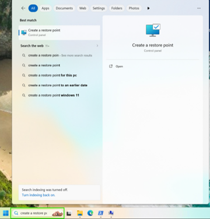
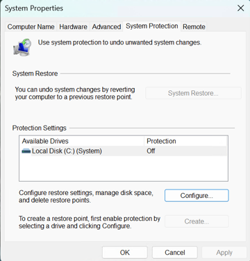
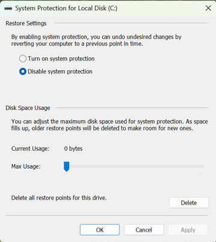
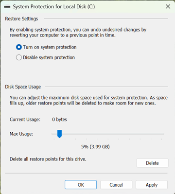
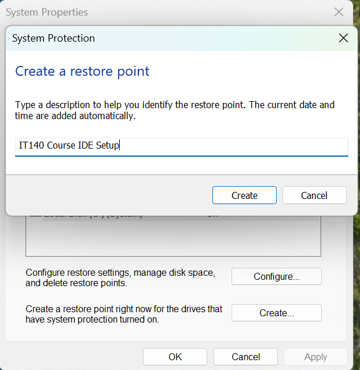
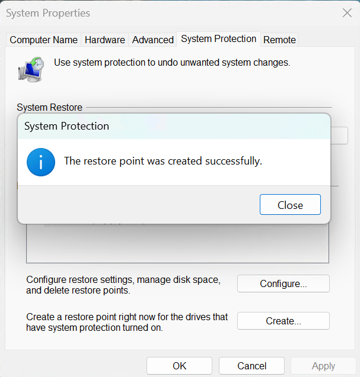
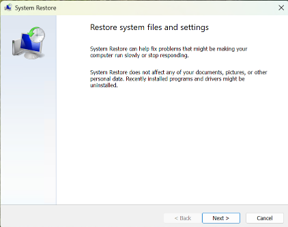
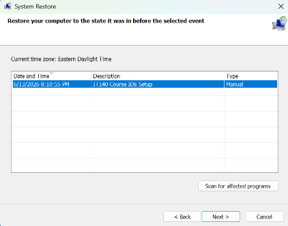
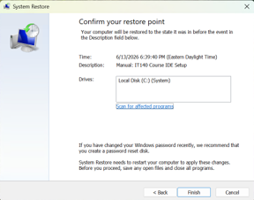

<!-- To see this file in a clean, formatted view, right-click on the filename and choose “Open Preview.” -->

# IT 140 Development Environment Local Setup on Windows

This document provides instructions for optionally setting up the IT 140 development environment (course IDE) on the Windows 11 operating system. It covers the installation of necessary software and tools needed to complete all course activities.

## 1. Create a Restore Point

Before installing any software, it is best practice to create a restore point using **Windows System Protection** recovery feature. That way, you can undo system changes if something goes wrong during setup.

1. On your keyboard, hold down the **Windows** (⊞) key and press the **S** key to open the **Search** application. In the search box, start typing ***Create a restore point***. Select the **Create a restore point** app from the results when it appears.

   
   

2. If the **Create…** button is selectable in the preceding image, skip to Step 4. If the **Create…** button is not selectable, as shown in the above right image, click the **Configure…** button.

3. Select the **Turn on system protection** radio button and adjust the **Max Usage** slider to 5%.
Click the **OK** button.

   
   

4. Click the **Create…** button. Enter a descriptive name for the restore point in the **System Protection** popup window, such as ***IT140 Course IDE Setup*** and click the **Create** button.

   
   

5. After the restore point is created, click the **Close…** button.

### Restore System (*if needed*)

> [!NOTE]
> If you ever want to restore your system to the state before you created a restore point without affecting your personal files, repeat Step 1 and click the System Restore button and then the **Next>** button. Select the desired restore point from the list and click the second **Next>** button. Then, click the **Finish** button.
>
> 
> 
> 

## 2. Open a Terminal Window with Administrator Privileges

The next phase in setting up the course IDE on your local Windows machine is to open a PowerShell terminal window with administrator privileges. You can do this by following these steps:

1. Hold down the **Windows** (⊞) key on your keyboard and press the **R** key to open the **Run** application.

2. In the **Run** dialog box, type ***powershell*** and press **Ctrl** + **Shift** + **Enter** to open with administrator privileges, regardless of which version of Run you see.

   
   

3. Verify the PowerShell terminal window title bar shows **Administrator: Windows PowerShell**, as shown in the image below. If it does not, close the window and repeat Steps 1–2.

   

   >[!NOTE]
   > The colors of your terminal window and prompt path (C:\Users\USERNAME) may be different than those shown in the screenshots, which is fine. Just make sure the window title bar shows **Administrator: Windows PowerShell**

> [!IMPORTANT]
> Do NOT proceed with the next phase of the installation until you successfully complete this step. Refer to the Troubleshooting section of this guide for additional help. If you get stuck, you can always use the course IDE in the Codio Virtual Desktop (Windows) to complete assignments until you get your local course IDE working.

## 3. Install the Course IDE on Windows

1. Using your pointing device (mouse, trackpad, etc.), click the **Copy** button in the top-right corner of the code block below

```powershell
Start-Transcript -Path "$env:USERPROFILE\Desktop\it140_setup.log" -Force
# Installing and updating system dependencies...
Add-AppxPackage -RegisterByFamilyName -MainPackage Microsoft.DesktopAppInstaller_8wekyb3d8bbwe
Install-PackageProvider -Name NuGet -Force | Out-Null
Install-Module -Name Microsoft.WinGet.Client -Force -Repository PSGallery | Out-Null
Repair-WinGetPackageManager -AllUsers
winget source update
# Installing course IDE components...
winget install --id Git.Git -e -s winget --silent --disable-interactivity --accept-source-agreements --accept-package-agreements --verbose-logs
winget install --id GitHub.cli -e -s winget --silent --disable-interactivity --accept-source-agreements --accept-package-agreements --verbose-logs
winget install --id Python.Python.3.12 -e -s winget --silent --disable-interactivity --accept-source-agreements --accept-package-agreements --verbose-logs
winget install --id Microsoft.VisualStudioCode -e -s winget --silent --disable-interactivity --accept-source-agreements --accept-package-agreements --verbose-logs
# Updating the terminal environment...
[System.Environment]::GetEnvironmentVariables('Machine').GetEnumerator() | ForEach-Object { Set-Item -Path "Env:\$($_.Key)" -Value $_.Value }; [System.Environment]::GetEnvironmentVariables('User').GetEnumerator() | ForEach-Object { Set-Item -Path "Env:\$($_.Key)" -Value $_.Value }; $env:Path = [System.Environment]::GetEnvironmentVariable('Path','Machine') + ';' + [System.Environment]::GetEnvironmentVariable('Path','User')
# Configuring course IDE components...
python.exe -m pip install --upgrade pip pytest pytest-cov ruff
git config --global init.defaultBranch main
git config --global core.editor "code --wait"
# Installing code editor extensions...
$env:NODE_NO_WARNINGS = "1"
code --install-extension ms-python.python --force
code --install-extension charliermarsh.ruff --force
code --install-extension hediet.vscode-drawio --force
code --install-extension streetsidesoftware.code-spell-checker --force
code --install-extension i2p-hub.i2p-pseudo --force
code --install-extension cweijan.vscode-office --force
Remove-Item Env:NODE_NO_WARNINGS -ErrorAction SilentlyContinue
# ===== Course IDE installation complete. =====
# Before continuing, review the messages above.
# Look for words like Error, Failed, Exception, Access denied, or not recognized.
# Some errors may appear in red text, but text color can vary.
# If you do not see an error message, continue to the next step.
# If you see an error, see the Troubleshooting section of the setup repo.
# A setup log was saved to your Desktop as: it140_setup.log.
# Detailed WinGet logs are available if tech support needs them; run: winget --logs.
Stop-Transcript

```

2. Paste clipboard contents into the **Administrator: Windows PowerShell** terminal at the command prompt by right-clicking immediately after **PS C:\WINDOWS\system32>**. Do NOT press **Ctrl** + **V** to paste.

3. Expect the commands to take 15 to 45 minutes, depending on your system and Internet speed.

> [!IMPORTANT]
> Do NOT proceed with the next phase of the installation until you successfully complete this step. Refer to the **Troubleshooting** section of this repository for additional help. If you get stuck, you can always use the course IDE in the Codio Virtual Desktop (Windows) to complete assignments until you get your local course IDE working.

## 4. Clone the Main Course Repository to Windows

1. Click once on the **Terminal** icon in the Windows task bar to open a terminal window.

2. Using your pointing device (mouse, trackpad, etc.), click the **Copy** button in the top-right corner of the code block below

```powershell
$Platform = 'win'
$CourseDir = Join-Path $HOME 'it140'
$TempDir = Join-Path ([System.IO.Path]::GetTempPath()) ([System.IO.Path]::GetRandomFileName())
$CloneDir = Join-Path $TempDir 'it140'
$ScriptsDir = Join-Path $CourseDir "scripts\$Platform"
New-Item -ItemType Directory -Path $CourseDir -Force | Out-Null
New-Item -ItemType Directory -Path $TempDir -Force | Out-Null
try {
    git clone --depth 1 'https://github.com/GC-STEM/it140.git' $CloneDir
    Remove-Item -Path (Join-Path $CloneDir '.git') -Recurse -Force -ErrorAction SilentlyContinue
    Get-ChildItem -Path $CloneDir -Force | Copy-Item -Destination $CourseDir -Recurse -Force
    Remove-Item -Path (Join-Path $CourseDir '.git') -Recurse -Force -ErrorAction SilentlyContinue
}
finally {
    Remove-Item -Path $TempDir -Recurse -Force -ErrorAction SilentlyContinue
}
$UserPath = [Environment]::GetEnvironmentVariable('Path', 'User')
$PathEntries = @($UserPath -split ';' | Where-Object { $_ })
if ($ScriptsDir -notin $PathEntries) {
    $NewUserPath = (@($PathEntries) + $ScriptsDir) -join ';'
    [Environment]::SetEnvironmentVariable('Path', $NewUserPath, 'User')
}
if ($ScriptsDir -notin ($env:Path -split ';')) {
    $env:Path = "$ScriptsDir;$env:Path"
}
$DesktopDir = [Environment]::GetFolderPath('Desktop')
$ShortcutPath = Join-Path $DesktopDir 'IT 140.lnk'
$Shell = New-Object -ComObject WScript.Shell
$Shortcut = $Shell.CreateShortcut($ShortcutPath)
$Shortcut.TargetPath = $CourseDir
$Shortcut.WorkingDirectory = $CourseDir
$Shortcut.IconLocation = '%SystemRoot%\System32\shell32.dll,3'
$Shortcut.Save()
```

3. In the terminal window, right-click and select **Paste**. Do NOT use keyboard shortcuts. If you use keyboard shortcuts (e.g., **Ctrl** + **V**), you will introduce unwanted characters into the command and it will not work.

4. Press **Enter** to run the pasted commands.

5. Close the terminal window by typing `exit` and pressing **Enter**.

## 5. Update the Windows

> [!IMPORTANT]
> If you update the Windows after starting work on course activities, save your work on another platform (e.g., GitHub, OneDrive, your local machine) before running the update script, just in case the update fails and we need to reset your VM. You do not need to backup if you have not save any work in the Windows yet.

1. Click once on the **Terminal** icon in the Windows task bar to open a terminal window.

2. Type `update_cvd.sh` into the terminal window and press **Enter**to run the automated Windows update script. Be patient, as this may take several minutes to complete.

3. Review the **Update Summary** notices to see if a VM restart is required.

4. Close the terminal window by typing `exit` and pressing **Enter**.

5. If a VM restart is required,
   1. Save any open work and close all windows in the Windows.
   2. Click on **RESTART VM** on the VM tab menu bar
   3. Wait for the Windows to restart and reconnect. It will take a few minutes.

## 6. Configure the Windows

1. Click once on the **Terminal** icon in the Windows task bar to open a terminal window.

2. Type `config_cvd.sh` in the terminal window and press **Enter** to configure the Windows with an interactive script.

3. Close the terminal window by typing `exit` and pressing **Enter**.

## 7. Sign into Cloud Storage Services (Optional)

1. Double-click on the "OneDrive" icon on the Windows desktop to open the OneDrive login page in Chrome. Be patient, as it may take a few seconds for the browser to open.

2. Sign into Chrome using your Google Account credentials if you wish to synchronize your Google Account settings, bookmarks, and extensions with the Windows, or use G-Drive as persistent storage. Otherwise, you may skip this step.

3. Sign into OneDrive using your SNHU credentials if you wish to use OneDrive as persistent storage for your work in the Windows. Otherwise, you may skip this step. If you choose to sign into OneDrive, follow the steps below:
   1. Enter your SNHU email address and click **Next**.
   2. Enter your SNHU password and click **Sign in**.
   3. If you see an **Install** button on the browser address bar, click it to install the OneDrive desktop app. If you do not see an **Install** button, skip this step.
   4. If prompted, click **Allow** to allow OneDrive to access resources on the Windows.

4. Close the browser window in the Windows when done signing into OneDrive and/or Chrome.

> [!NOTE]
> The first time you double-click on the OneDrive icon, you may see an **Untrusted Application** warning. If you see this message, click **OK**.

## 8. Configure Visual Studio Code in the Windows

1. Double-click on the **Visual Studio Code** icon on the Windows desktop.

2. Sign into VS Code using one of the following methods:
   - **Continue with GitHub** (highly recommended)
   - **Sign in with Google** (click on **G** icon)
   - **Sign in with Apple** (click on Apple icon)
   - **Continue without Signing in**

   > [!NOTE]
   > If you do not see the Welcome page, click the blue **Sign in** button on the VS Code menu bar.

3. If prompted, authorize VS Code to access GitHub or other linked account(s).

4. If prompted, **Open xdg-open?**, check the "Always allow" box and click **Open xdg-open** button.

5. If prompted, select your color theme. Course screenshots and videos show the "Dark High Contrast" theme, but you may choose the theme you prefer.

6. Click the **Get Started** button on the **Welcome** page to dismiss it.

   > [!IMPORTANT]
   > If you ever see an **Update** button on the VS Code menu bar in the Windows, don't press it. You can ignore it or update the Windows by re-running `update_cvd.sh`. Be sure to save your work on another platform (e.g., GitHub, OneDrive, your local machine) before updating the Windows, just in case the update fails and we need to reset your VM.

## 9. Verify Your Windows Configuration

{{SME TODO: Develop Windows verification script and add verification instructions for Windows configuration.}}

## Next Step

Once you have completed Codio Virtual Desktop (Windows) configuration, you may stop here. You may complete all course activities from web-based learning platforms–Brightspace, zyBooks, and Codio.

However, we recommend you set up the course IDE on at least one local computer, if possible. Doing so provides an alternative development environment in case the Windows is unavailable and provides access after the course. Your VS Code and your GitHub account will synchronize your work between the Windows and your local course IDE, so you can continue working on assignments from either environment.

- **Set Up the Course IDE on Your Local Computer(s)**
  - [Windows](../local/windows/README.md)
  - [MacOS](../local/macos/README.md)
  - [Linux](../local/linux/README.md)

## Troubleshooting

{{SME TODO: Add troubleshooting information for Windows configuration.}}
