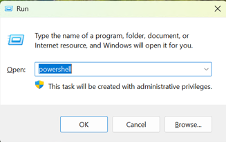
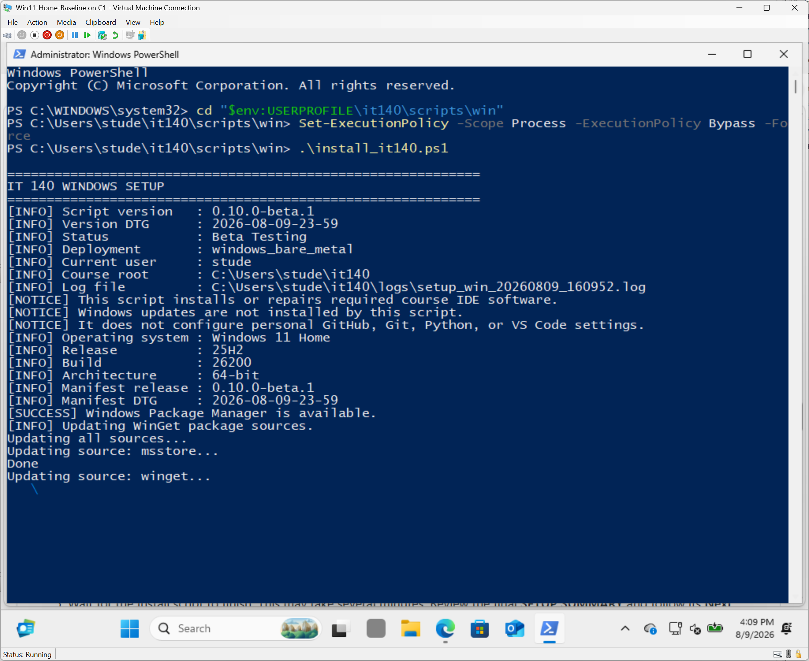
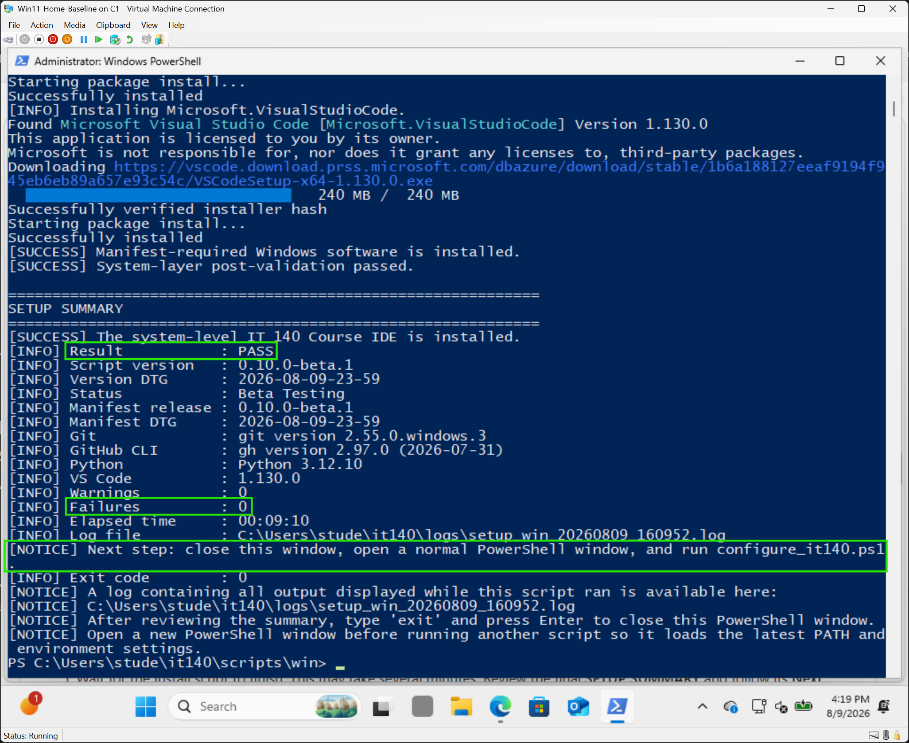
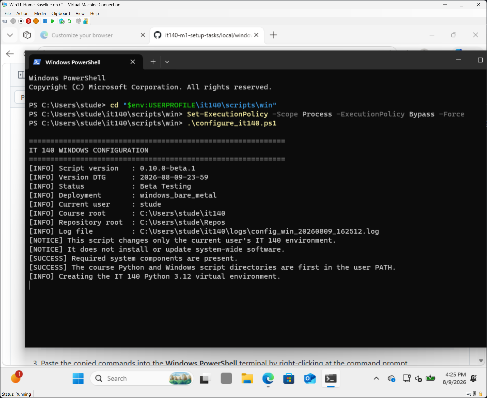
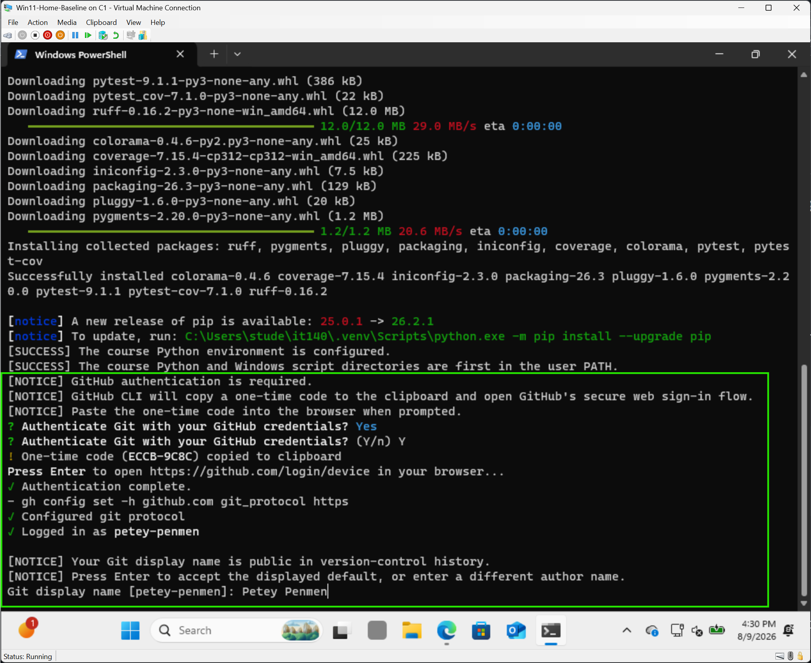
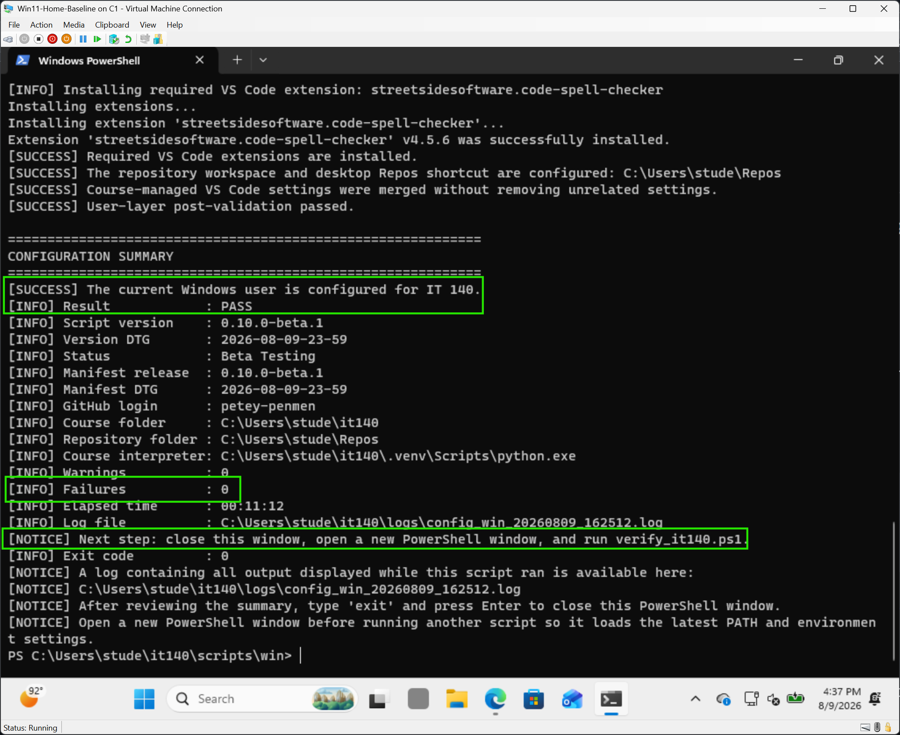
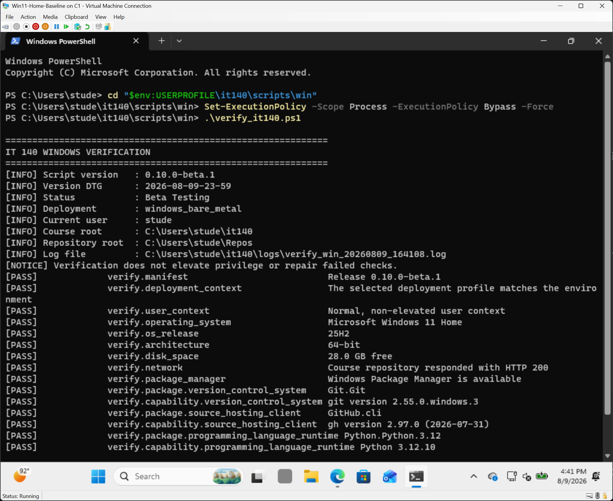
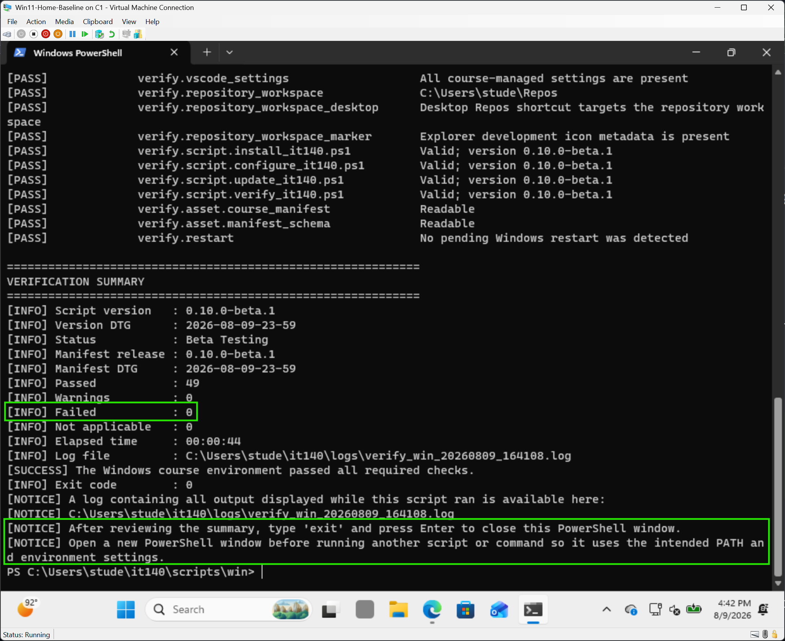

<!-- To see this file in a clean, formatted view, right-click on the filename and choose “Open Preview.” -->

# IT 140 Development Environment Local Setup on Windows

This document provides step-by-step instructions for installing the IT 140 development environment (course IDE) on a [publisher-supported version of Windows](https://learn.microsoft.com/en-us/windows/release-health/supported-versions-windows-client). These local installation files and automation scripts are designed exclusively for students who have access to an administrator account on their computer. Following these steps will configure all the necessary programming software and developer tools required to complete your course activities.

> [!IMPORTANT]
> The following setup phases are sequential. Do NOT proceed with the next phase of the installation until you have fully completed the preceding phases. Refer to the [Troubleshooting](#troubleshooting) section of this guide for additional help. If you get stuck, you can always use the course IDE in the Codio Virtual Desktop (CVD) to complete assignments until you get your local course IDE working.

## Activity Metadata

- **Course**: IT 140 - *Introduction to Scripting*
- **Activity Title**: 1-1 Setup Tasks | Local Setup | Windows
- **Activity Type**: Optional, non-graded, no submission
- **Activity Purpose**: Prepare the IT 140 development environment for completing course assignments on your local Windows computer.
- **Activity Description**: This activity provides step-by-step instructions for installing the IT 140 development environment (course IDE) on a publisher-supported version of Windows. These local installation files and automation scripts are designed exclusively for students who have access to an administrator account on their computer. Following these steps will configure all the necessary programming software and developer tools required to complete your course activities.
- **Artifact Version**: 0.10.0-beta.1
- **Artifact Date**: 2026-08-09
- **Development Status**: Beta Testing

## 0. Check System Compatibility

Before setting up the course IDE on Windows, we must verify that your computer's security permissions allow you to run software developer tools. It is common for users of computers owned by others to have restricted account privileges. Another restriction can come from manufacturer default settings, such as [Windows S Mode](https://support.microsoft.com/en-us/windows/experience/platform-variants/windows-10-and-windows-11-in-s-mode-faq). This simple 5-second test will determine if your machine can support local setup of the course IDE, or if you should bypass it and use just the Codio Virtual Desktop (CVD) option.

1. On your keyboard, press the **Windows** (⊞) + **R** keys at the same time to open the **Run** dialog box.

2. Type `cmd` into the box and press **Enter**.

3. Observe what happens on your screen:

   - **GO**: A terminal window opens and shows a blinking cursor after the command prompt. Your computer's operating system likely allows local command-line tools.
   **Recommendation**: Continue with local setup of the course IDE.

   > *Note*. This test only confirms that command-line tools can open. **Step 4: Install the Course IDE** also requires an administrator account. If you cannot approve an administrator prompt when you reach Step 4, use the CVD instead.

   <!--SME TODO: Add screenshots for GO.-->

   - **NO GO**: An error popup appears, or the window immediately closes. Your computer's operating system or employer-managed security policy blocks local command-line tools. You will not be able to install or run the course IDE locally unless you resolve these issues.  
   **Recommendation**: Use just the CVD. Go to the [Codio README.md](../../codio/README.md) to configure the CVD, if you have not done so already. Otherwise, return to the main [README.md](../../README.md) to complete any outstanding tasks.

   <!--SME TODO: Add screenshots for NOGO.-->

   <!--SME TODO: Add link(s) to remedial instructions for NOGO when they are developed. For example, disable Windows S Mode, -->

## 1. Create a Restore Point

Before installing any software, it is best practice to enable system protection and create a restore point using **Windows System Protection**. That way, you can undo system changes if something goes wrong during setup.

1. On your keyboard, hold down the **Windows** (⊞) key and press the **S** key to open the **Search** application. In the search box, start typing ***Create a restore point***. Select the **Create a restore point** app from the results when it appears.

   
   

2. If the **Create…** button is selectable in the preceding image, skip to Step 4. If the **Create…** button is not selectable, as shown in the above second image, click the **Configure…** button.

3. Select the **Turn on system protection** radio button and adjust the **Max Usage** slider to 5%.
Click the **OK** button.

   
   

4. Click the **Create…** button. Enter a descriptive name, such as ***Before General Update***, for the restore point in the **System Protection** popup window and click the **Create** button.

   
   

5. After the restore point is created, click the **Close…** button.

### Restore System (*if needed*)

> [!NOTE]
> If you ever want to restore your system to the state before you created a restore point without affecting your personal files, repeat Step 1 and click the System Restore button and then the **Next>** button. Select the desired restore point from the list and click the second **Next>** button. Then, click the **Finish** button.
>
> 
> 
> 

## 2. Update the Operating System

Before installing the course IDE, make sure Windows has the latest updates. Updating first helps prevent problems when the course automation scripts install programming software.

1. On your keyboard, hold down the **Windows (⊞)** key and press the **S** key to open Search.

2. Type **Check for updates** in the search box, then select **Check for updates** from the results. This opens Windows Update in the Settings app.

3. Click the **Check for updates** button.

4. Allow Windows to download and install any required updates it finds.

   > [!NOTE]
   > You do not need to install **optional updates**, **preview updates**, or **optional driver updates** for this course.

5. If Windows asks you to restart your computer, save any open work and click **Restart now**.

6. After your computer restarts, sign back in and repeat Steps 1–3. Continue installing required updates and restarting when requested until Windows Update reports that your computer is up to date.

7. Create another restore point using the instructions in **Step 1: Create a Restore Point**. Name this restore point:

   ```text
   Before IT140 Course IDE Setup
   ```

   This restore point gives you a known working Windows configuration to return to if you experience a problem while setting up the course IDE.

Once Windows is up to date and you have created the new restore point, continue to **Step 3**.

## 3. Prepare the Course Automation Package

Before the course IDE can be installed, you need the current IT 140 automation package. This first setup action is sometimes called **bootstrapping**. The commands below download the current Prepare script, which places the course automation files in your `it140` folder and makes the Windows lifecycle scripts available to PowerShell.

> [!IMPORTANT]
> Run this step from a **regular Windows PowerShell** terminal. Do **not** run it as an administrator.

1. Hold down the **Windows** (⊞) key on your keyboard and press the **R** key to open the **Run** application.

2. In the **Run** dialog box, type ***powershell*** and press **Enter**.

   

3. Make sure **Administrator** does **not** appear in the PowerShell window title bar. If it does, close the window and repeat Steps 1–2.

4. Click the **Copy** button in the top-right corner of the code block below.

   ```powershell
   $PrepareScript = Join-Path $env:TEMP "prepare_it140.ps1"
   Invoke-WebRequest -Uri "https://raw.githubusercontent.com/GC-STEM/it140/main/scripts/win/prepare_it140.ps1" -OutFile $PrepareScript -UseBasicParsing
   Set-ExecutionPolicy -Scope Process -ExecutionPolicy Bypass -Force
   & $PrepareScript

   ```

5. Paste the copied commands into the **Windows PowerShell** terminal by right-clicking at the command prompt.

6. Press **Enter** once if the commands do not start automatically.

7. Wait for the Prepare script to finish and for the PowerShell command prompt to return. Review the final messages before continuing.

8. Type `exit` and press **Enter** to close the PowerShell terminal window.

## 4. Install the Course IDE

The Install script adds or repairs the system-level software required for the course. This step requires administrator privileges.

1. Open a new **Windows PowerShell** terminal with administrator privileges.

   1. Press **Windows** (⊞) + **R**.
   2. Type ***powershell***.
   3. Press **Ctrl** + **Shift** + **Enter**.
   4. If Windows displays a **User Account Control** prompt, click **Yes**.
   5. Make sure **Administrator** appears in the PowerShell window title bar.

   
   

2. Click the **Copy** button in the top-right corner of the code block below.

   ```powershell
   cd "$env:USERPROFILE\it140\scripts\win"
   Set-ExecutionPolicy -Scope Process -ExecutionPolicy Bypass -Force
   .\install_it140.ps1

   ```

3. Paste the copied commands into the **Administrator: Windows PowerShell** terminal by right-clicking at the command prompt.

4. Press **Enter** once if the script does not start automatically.

   

5. Wait for the Install script to finish. This may take several minutes. Review the final **SETUP SUMMARY** and follow its **Next step** instructions. Make sure:

   - **Result**: `PASS`
   - **Failures**: `0`

   

6. If the Install script tells you to restart Windows, save your work, restart the computer, and sign back in before continuing to Step 5.

7. If a restart is not required, type `exit` and press **Enter** to close the Administrator PowerShell window before continuing to Step 5.

## 5. Configure the Course IDE

The Configure script sets up the course IDE for your Windows user account. It may ask you to sign into GitHub and confirm your Git display name. This process is very similar to configuring the course IDE in the Codio Virtual Desktop (CVD). If you need more detailed instructions or screenshots, see the **[codio/README.md](../../codio/README.md#configure-the-course-ide)** file.

1. Open a new PowerShell terminal window as a **regular user**.
   1. Hold down the **Windows** (⊞) key on your keyboard and press the **R** key to open the **Run** application.
   2. In the **Run** dialog box, type ***powershell*** and press **Enter**.
   3. Make sure **Administrator** does **not** appear in the terminal window title bar. If it does, close the window and repeat Steps 5.1.1–5.1.2.

2. Click the **Copy** button in the top-right corner of the code block below.

   ```powershell
   cd "$env:USERPROFILE\it140\scripts\win"
   Set-ExecutionPolicy -Scope Process -ExecutionPolicy Bypass -Force
   .\configure_it140.ps1

   ```

3. Paste the copied commands into the **Windows PowerShell** terminal by right-clicking at the command prompt.

4. Press **Enter** once if the script does not start automatically.

   

5. Follow the on-screen prompts to complete the configuration. If GitHub authentication is required, the script will guide you through the secure web sign-in process.

   

6. When the script finishes, review the final **CONFIGURATION SUMMARY** and follow its **Next step** instructions. Make sure:

   - **Result**: `PASS`
   - **Failures**: `0`

   

7. Type `exit` and press **Enter** to close the PowerShell terminal window.

## 6. Verify the Course IDE

The Verify script checks that the required course software and settings are ready to use. It does not install or change the course IDE.

1. Open a new PowerShell terminal window as a **regular user**.
   1. Hold down the **Windows** (⊞) key on your keyboard and press the **R** key to open the **Run** application.
   2. In the **Run** dialog box, type ***powershell*** and press **Enter**.
   3. Make sure **Administrator** does **not** appear in the terminal window title bar. If it does, close the window and repeat Steps 6.1.1–6.1.2.

2. Click the **Copy** button in the top-right corner of the code block below.

   ```powershell
   cd "$env:USERPROFILE\it140\scripts\win"
   Set-ExecutionPolicy -Scope Process -ExecutionPolicy Bypass -Force
   .\verify_it140.ps1

   ```

3. Paste the copied commands into the **Windows PowerShell** terminal by right-clicking at the command prompt.

4. Press **Enter** once if the script does not start automatically.

   

5. Review the final **VERIFICATION SUMMARY**. If Verify reports a problem, follow the remediation instructions shown in the terminal before continuing. Make sure **Failures**: `0`.

   

6. Type `exit` and press **Enter** to close the PowerShell terminal window.

## 7. Configure Visual Studio Code

1. Press the **Windows** (⊞) key, type **Visual Studio Code**, and open **Visual Studio Code** from the search results.

2. Sign into VS Code using one of the following methods:
   - **Continue with GitHub** (highly recommended)
   - **Sign in with Google** (click on the **G** icon)
   - **Sign in with Apple** (click on the Apple icon)
   - **Continue without Signing in**

   > *Note*. If you do not see the Welcome page, click the blue **Sign in** button on the VS Code menu bar.

3. If prompted, authorize VS Code to access GitHub or other linked account(s).

4. If prompted, check the **Always allow** box and click the **Open** button.

5. If prompted, select your color theme. Course screenshots and videos show the **Dark High Contrast** theme, but you may choose the theme you prefer.

6. Click the **Get Started** button on the **Welcome** page to dismiss it.

   > *Important*. If VS Code reports that an update is available, you do not need to install it directly from VS Code. The IT 140 Update script maintains VS Code and the other managed course IDE components. See **Step 8: Periodic Updates to Course IDE** below.

## 8. Periodic Updates to Course IDE

The IT 140 Update script keeps the managed course IDE software, Python tools, VS Code extensions, and course automation files current. It does **not** run Windows Update; continue using Windows Update normally for operating-system updates.

Run the IT 140 Update script when your course instructions ask you to update the IDE or when you need to bring the managed course software up to date.

1. Open a new PowerShell terminal window as a **regular user**.
   1. Press **Windows** (⊞) + **R**.
   2. Type ***powershell*** and press **Enter**.
   3. Make sure **Administrator** does **not** appear in the terminal window title bar.

2. Click the **Copy** button in the top-right corner of the code block below.

   ```powershell
   cd "$env:USERPROFILE\it140\scripts\win"
   Set-ExecutionPolicy -Scope Process -ExecutionPolicy Bypass -Force
   .\update_it140.ps1

   ```

3. Paste the copied commands into the **Windows PowerShell** terminal and press **Enter** once if the script does not start automatically.

4. If Windows displays a **User Account Control** prompt during the update, click **Yes**. The Update script requests administrator privileges only when it needs to maintain system-wide course software.

5. Wait for the Update script to finish. Review the final **UPDATE SUMMARY** and follow its **Next step** instructions.

6. After a successful update, open a **new regular PowerShell window** before running the next lifecycle script. In most cases, Update will tell you to run Verify. If it tells you to run Configure first, complete Configure and then run Verify in another new PowerShell window.

## Next Step

Once you have completed setting up the course IDE on one local computer, you may stop here until you are ready to start on the Module Two assignment. However, we recommend you also configure the course IDE on Codio, if you have not done so already.

- **[Configure the course IDE on Codio](../../codio/README.md)**

Optionally, if you have another local computer, you can also set up the course IDE on that machine. See the following links for instructions:

- **Set up the course IDE on another local computer**
  - [macOS](../macOS/README.md)
  - [Linux](../linux/README.md)

## Troubleshooting

If a setup or verification script reports an error, review the final summary and the log file identified by the script. IT 140 automation logs are stored in your `it140\logs` folder.

For troubleshooting guidance and information to include when asking for help, see the main activity's **[Technical Support](../../README.md#technical-support)** section.
