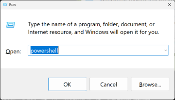
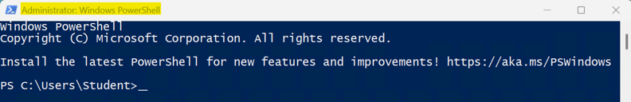

# Set Up the Course IDE on Windows Using CLI

These instructions will guide you through the process of setting up the course IDE on your local Windows machine using a command line interface (CLI). The setup process will install and configure all necessary components, including Git, Python, Visual Studio Code, and required extensions. {{TODO: Add advantages of using the CLI setup method and disadvantages for students new to the CLI.}}

{{TODO: Add that GUI setup instructions are available in a separate guide (e.g., `./gui_setup.md`) if the student prefers that method.}}

## 1. Open a Terminal Window with Administrator Privileges

1. Hold down the **Windows** (⊞) key on your keyboard and press the **R** key to open the **Run** application.

2. In the **Run** dialog box, type ***powershell*** and press **Ctrl** + **Shift** + **Enter** to open a PowerShell terminal with administrator privileges, regardless of which version of the **Run** application you see.

   
   

3. Verify the PowerShell terminal window title bar shows **Administrator: Windows PowerShell**, as shown in the image below. If it does not, close the window and repeat Steps 1–2.

   

   >[!NOTE]
   > The colors of your terminal window and prompt path may be different than those shown in the screenshots, which is fine (e.g., `C:\Users\USERNAME` or `C:\Windows\System32`). Just make sure the window title bar shows **Administrator: Windows PowerShell**

> [!IMPORTANT]
> Do NOT proceed with the next phase of the installation until you successfully complete this step. Refer to the Troubleshooting section of this guide for additional help. If you get stuck, you can always use the course IDE in the Codio Virtual Desktop (CVD) to complete assignments until you get your local course IDE working.

## 2. Install the Course IDE on Windows Using CLI

1. Click the **Copy** button in the top-right corner of the code block below.

    ```powershell
    Start-Transcript -Path "$env:USERPROFILE\Desktop\it140_setup.log" -Force
    # Installing and updating system dependencies...
    Add-AppxPackage -RegisterByFamilyName -MainPackage Microsoft.DesktopAppInstaller_8wekyb3d8bbwe
    Install-PackageProvider -Name NuGet -Force | Out-Null
    Install-Module -Name Microsoft.WinGet.Client -Force -Repository PSGallery | Out-Null
    Repair-WinGetPackageManager -AllUsers
    winget source update
    # Installing course IDE components...
    winget install --id Git.Git -e -s winget --silent --disable-interactivity --accept-source-agreements --accept-package-agreements --verbose-logs
    winget install --id GitHub.cli -e -s winget --silent --disable-interactivity --accept-source-agreements --accept-package-agreements --verbose-logs
    winget install --id Python.Python.3.12 -e -s winget --silent --disable-interactivity --accept-source-agreements --accept-package-agreements --verbose-logs
    winget install --id Microsoft.VisualStudioCode -e -s winget --silent --disable-interactivity --accept-source-agreements --accept-package-agreements --verbose-logs
    # Updating the terminal environment...
    [System.Environment]::GetEnvironmentVariables('Machine').GetEnumerator() | ForEach-Object { Set-Item -Path "Env:\$($_.Key)" -Value $_.Value }; [System.Environment]::GetEnvironmentVariables('User').GetEnumerator() | ForEach-Object { Set-Item -Path "Env:\$($_.Key)" -Value $_.Value }; $env:Path = [System.Environment]::GetEnvironmentVariable('Path','Machine') + ';' + [System.Environment]::GetEnvironmentVariable('Path','User')
    # Configuring course IDE components...
    python.exe -m pip install --upgrade pip pytest pytest-cov ruff
    git config --global init.defaultBranch main
    git config --global core.editor "code --wait"
    # Installing code editor extensions...
    $env:NODE_NO_WARNINGS = "1"
    code --install-extension ms-python.python --force
    code --install-extension charliermarsh.ruff --force
    code --install-extension hediet.vscode-drawio --force
    code --install-extension streetsidesoftware.code-spell-checker --force
    code --install-extension i2p-hub.i2p-pseudo --force
    code --install-extension cweijan.vscode-office --force
    Remove-Item Env:NODE_NO_WARNINGS -ErrorAction SilentlyContinue
    # ===== Course IDE installation complete. =====
    # Before continuing, review the messages above.
    # Look for words like Error, Failed, Exception, Access denied, or not recognized.
    # Some errors may appear in red text, but text color can vary.
    # If you do not see an error message, continue to the next step.
    # If you see an error, see the Troubleshooting section of the setup repo.
    # A setup log was saved to your Desktop as: it140_setup.log.
    # Detailed WinGet logs are available if tech support needs them; run: winget --logs.
    Stop-Transcript
    ```

2. Paste clipboard contents into the **Administrator: Windows PowerShell** terminal at the command prompt by right-clicking immediately after the command prompt (e.g., `C:\Users\USERNAME` or `C:\Windows\System32`). Do NOT press **Ctrl** + **V** to paste.

3. Expect the commands to take 15 to 45 minutes, depending on your system and Internet speed.

> [!IMPORTANT]
> Do NOT proceed with the next phase of the installation until you successfully complete this step. Refer to the **Troubleshooting** section of this repository for additional help. If you get stuck, you can always use the course IDE in the Codio Virtual Desktop (CVD) to complete assignments until you get your local course IDE working.

